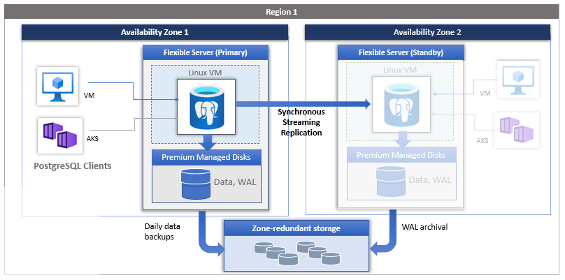
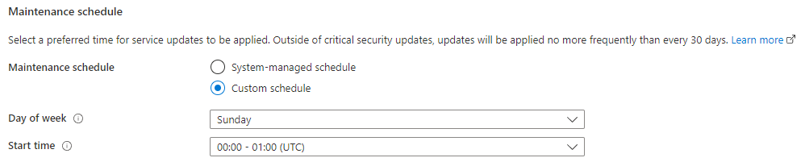

## Introduction to Azure Database for PostgreSQL Flexible Server

Developers can deploy PostgreSQL on Azure through Virtual Machines (IaaS) or Azure Database for PostgreSQL Flexible Server (PaaS). Azure Database for PostgreSQL Flexible Server offers high availability, automated backups, and meets compliance requirements. Operational administrators do not have the operational overhead of managing the OS and the DB engine. They do not need to worry about OS patching, database backups, or server security. Administrators only need to manage the applications and data. Developers can focus on schema design, building queries, and optimizing query performance.

Azure Database for PostgreSQL Flexible Server supports PostgreSQL Community Editions 11 through 16, making it flexible for most migrations.

**Control Plane**
As the image below demonstrates, Azure Resource Manager handles resource configuration, meaning that standard Azure management tools, such as the CLI, PowerShell, and ARM templates, are still applicable. This is commonly referred to as the *control plane*.

**Data Plane**
For managing database objects and access controls at the server and database levels, standard PostgreSQL management tools, such as [pgAdmin](https://www.pgadmin.org/), still apply. This is known as the *data plane*.

### Azure Database for PostgreSQL Flexible Server deployment options

Azure Database for PostgreSQL Flexible Server provides two options for deployment: Single Server and Flexible Server. Below is a summary of these offerings. For a more comprehensive comparison table, please consult the article [Choose the right PostgreSQL Server option in Azure](https://learn.microsoft.com/en-us/azure/postgresql/flexible-server/concepts-compare-single-server-flexible-server).

> **Note:** This guide will be focused on Flexible Server and will not explore Single Server.

##### Flexible Server video introduction

> **Watch:** [Introduction to the Beginners Series [1 of 16] | Azure Database for PostgreSQL Flexible Server - Beginners Series](https://www.youtube.com/watch?v=TcPpNu45p78)

> **Watch:** [Top 3 Reasons to consider Azure Database for PostgreSQL Flexible Server](https://docs.microsoft.com/shows/data-exposed/top-3-reasons-to-consider-azure-database-for-PostgreSQL-flexible-server/) to learn more about Flexible Server's advantages.

Cost management is one of the advantages of Flexible Server: it supports a *burstable* tier, which is based on the B-series Azure VM tier and is optimized for workloads that do not continually use the CPU. [Flexible Server instances can also be paused](https://learn.microsoft.com/azure/postgresql/flexible-server/flexible-server/how-to-restart-stop-start-server-cli). The image below shows how Flexible Server works for a non-high availability arrangement.

> *Locally-redundant storage* replicates data within a single [availability zone](https://docs.microsoft.com/azure/availability-zones/az-overview). *Availability zones* are present within a single Azure region (such as East US) and are geographically isolated. All Azure regions that support availability zones have at least three zones.

Here are a few other notable advantages of Flexible Server.

- [User-scheduled service maintenance:](https://learn.microsoft.com/azure/postgresql/flexible-server/flexible-server/concepts-maintenance) Flexible Server allows database administrators to set a day of the week and a time for Azure to perform service maintenance and upgrades, **per server**. Providing notifications five days before a planned maintenance event, Flexible Server caters to the needs of IT operations personnel.

  

- [Network security:](https://learn.microsoft.com/azure/postgresql/flexible-server/flexible-server/concepts-networking) Applications access Flexible Server through the public Internet (though access is governed by firewall ACLs), or through private IP addresses in an Azure Virtual Network. Moreover, TLS support keeps traffic encrypted, irrespective of the chosen network access model.

- [Automatic backups:](https://learn.microsoft.com/azure/postgresql/flexible-server/flexible-server/overview) Azure automates database backups, encrypts them, and stores them for a configurable period.

  

- [Read replicas:](https://learn.microsoft.com/azure/postgresql/flexible-server/flexible-server/concepts-read-replicas) Read replicas help teams scale their applications by providing read-only copies of the data updated on the master node. Often, applications that run on elastic, autoscaling services, like Azure App Service, couple well with read replicas.
  
- [Input-output operations per second (IOPS):](https://learn.microsoft.com/azure/postgresql/flexible-server/flexible-server/concepts-compute-storage#iops) IOPS can be configured based on your performance needs.

  

##### Flexible Server pricing & TCO

The PostgreSQL Flexible Server tiers offer a storage range between 32 GiB and 32 TiB and the same backup retention period range of 1-35 days. However, they differ in core count and memory per vCore. Choosing a compute tier affects the database IOPS and pricing.

- **Burstable**: This tier corresponds to a B-series Azure VM. Instances provisioned in this tier have 1-20 vCores. It is ideal for applications that do not utilize the CPU consistently.
- **General Purpose**: This tier corresponds to a Ddsv4-series Azure VM. Instances provisioned in this tier have 2-96 vCores and 4 GiB memory per vCore. It is ideal for most enterprise applications requiring a strong balance between memory and vCore count.
- **Memory Optimized**: This tier corresponds to an Edsv4-series Azure VM. Instances provisioned in this tier have 2-96 vCores and 8 GiB memory per vCore. It is ideal for high-performance or real-time workloads that depend on in-memory processing.

To estimate the TCO for Azure Database for PostgreSQL Flexible Server:

1. Use the [Azure Pricing Calculator](https://azure.microsoft.com/pricing/calculator/).

   > **Note:** The [Azure TCO Calculator](https://azure.microsoft.com/pricing/tco/calculator/) can be used to estimate the cost savings of deploying PaaS Azure PostgreSQL over the same deployment in an on-premises data center.
2. Indicate the configuration of on-premises hardware and the Azure landing zone, adjust calculation parameters, like the cost of electricity, and observe the potential savings.

##### Flexible Server Unsupported Features

Azure provides a [detailed list of the limitations of Flexible Server](https://learn.microsoft.com/azure/postgresql/flexible-server/concepts-limits). Here are a few notable ones.

- Users are not provided host or OS access to view or modify configuration files such as postgresql.conf
- You can't create or load your own extension in Azure Database for PostgreSQL.
