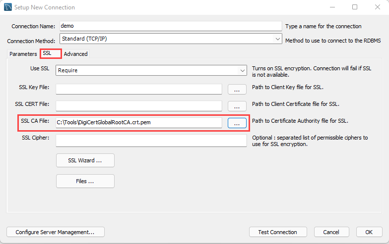

## Connect and query Azure Database for PostgreSQL Flexible Server using PostgreSQL Workbench

This section explains how to perform queries against Azure Database for PostgreSQL Flexible Server Flexible Server using PostgreSQL Workbench, a UI-based management tool.

### Setup

Follow one of the methods in the [Create a Flexible Server database] document to create a Flexible Server instance with a database.

Download PostgreSQL Workbench from the [PostgreSQL Downloads.](https://dev.PostgreSQL.com/downloads/workbench/)

### Instructions

Explore the [Use PostgreSQL Workbench with Azure Database for PostgreSQL Flexible Server Flexible Server](https://learn.microsoft.com/azure/postgresql/flexible-server/flexible-server/connect-workbench) article to perform the following activities:

- Create a new database in the Flexible Server instance
- Create, query, and update data in a table (inventory)
- Delete records from the table

> **Note:** PostgreSQL Workbench can automatically initiate an SSL-secured connection to Azure Database for PostgreSQL Flexible Server. However, it is recommended to use the [SSL public certificate](https://dl.cacerts.digicert.com/DigiCertGlobalRootCA.crt.pem) in the connections. To bind the SSL public certificate to PostgreSQL Workbench, choose the downloaded certificate file as the **SSL CA File** on the **SSL** tab.

