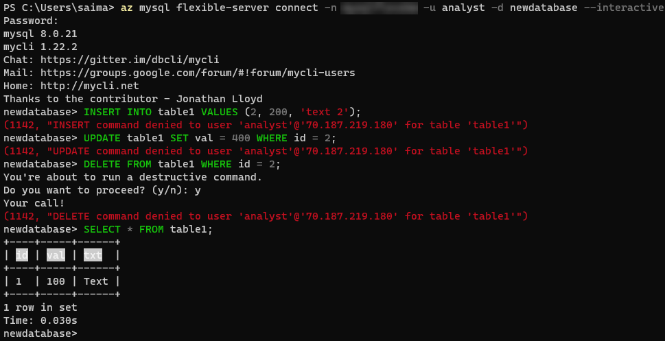

## Connect and query Azure Database for PostgreSQL Flexible Server using the Azure CLI

pgAdmin is not the only method of running queries against your PostgreSQL database. This section explains how to perform queries against Azure Database for PostgreSQL Flexible Server using the Azure CLI and the `az postgresql flexible-server` utilities and references the steps in the [Quickstart: Connect and query with Azure CLI with Azure Database for PostgreSQL Flexible Server - Flexible Server](https://learn.microsoft.com/azure/postgresql/flexible-server/flexible-server/connect-azure-cli#create-a-database) article.

### Setup

While the Azure article demonstrates how to provision a Flexible Server instance using the CLI, any of the presented provisioning methods in the [Create a Flexible Server database] section are possible.

### Instructions

The Azure CLI supports running queries interactively, via the `az postgresql flexible-server connect` command, which is similar to running queries interactively against a PostgreSQL instance through the PostgreSQL CLI. It is also possible to run an individual SQL query or a SQL file using the `az postgresql flexible-server execute` command.

> **Note:** These commands require the `rdbms-connect` CLI extension, which is automatically installed if it is not present. If permissions errors are encountered from the Azure Cloud Shell, execute the commands from a local installation of the Azure CLI.

In addition to the queries in the document, it is also possible to run basic admin queries. The statements below create a new user `analyst` that can read data from all tables in `newdatabase`.

```sql
USE newdatabase;
CREATE USER 'analyst'@'%' IDENTIFIED BY '[SECURE PASSWORD]';
GRANT SELECT ON newdatabase.* TO 'analyst'@'%';
FLUSH PRIVILEGES;
```

The new `analyst` user can also connect to `newdatabase` in the Flexible Server instance. The new user can only query tables in `newdatabase`.



> For more details on creating databases and users in Flexible Server, consult [this document.](https://learn.microsoft.com/azure/postgresql/flexible-server/howto-create-users?tabs=flexible-server) Note that it uses the `PostgreSQL` CLI.
