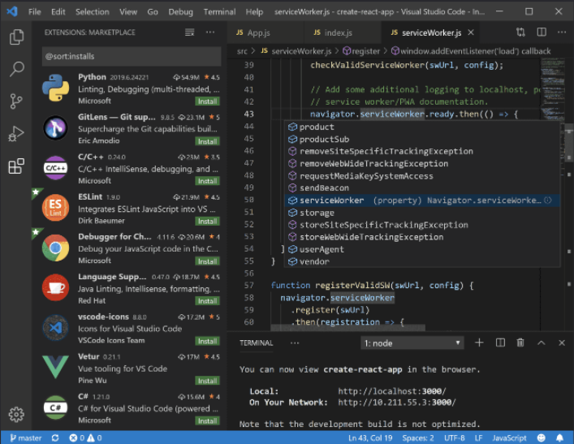

# 03 / Getting Started - Setup and Tools

With a firm understanding of PostgreSQL and other offerings available in Azure, it is time to review how to start using these various services in applications. In this chapter, we explore how to get Azure subscriptions configured and ready to host PostgreSQL applications. Common PostgreSQL application types and the various tools to simplify their deployment will reviewed. Sample code will make it easier to get started faster and understand high-level concepts.

## Azure free account

Azure offers a [$200 free credit for developers to trial Azure](https://azure.microsoft.com/free) or jump right into a Pay-as-you-go subscription. The free account includes credits for 750 compute hours of Azure Database for PostgreSQL Flexible Server - Flexible Server. [Innovate faster with fully managed PostgreSQL and an Azure free account.](https://learn.microsoft.com/azure/postgresql/flexible-server/how-to-deploy-on-azure-free-account)

## Azure subscriptions and limits

As explained in the [Introduction to Azure resource management](../02_IntroToPostgreSQL/02_02_Introduction_to_Azure_resource_mgmt.md), subscriptions are a critical component of the Azure hierarchy: resources cannot be provisioned without an Azure subscription, and although the cloud is highly scalable, it is not possible to provision an unlimited number of resources. A set of initial limits applies to all Azure subscriptions. However, the limits for some Azure services can be raised, assuming that the Azure subscription is not a free trial. Organizations can raise these limits by submitting support tickets through the Azure Portal. Limit increase requests help tell Microsoft capacity planning teams to understand if they need to provide more capacity when needed.

Since most Azure services are provisioned in regions, some limits apply at the regional level. Developers must consider both global and regional subscription limits when developing and deploying applications.

Consult [Azure's comprehensive list of service and subscription limits](https://docs.microsoft.com/azure/azure-resource-manager/management/azure-subscription-service-limits) for more details.

## Azure authentication

As mentioned previously, Azure Database for PostgreSQL Flexible Server consists of a data plane (data storage and data manipulation) and a control plane (management of the Azure resource). Authentication is separated between the control plane and the data plane as well.

In the control plane, Microsoft Entra authenticates users and determines whether users are authorized to operate against an Azure resource. Review Azure RBAC in the [Introduction to Azure resource management] section for more information.

The built-in PostgreSQL account management system governs access for administrator and non-administrator users in the data plane. Moreover, Azure Database for PostgreSQL supports security principals in Microsoft Entra, like users and groups, for data-plane access management. Using AAD data-plane access management allows organizations to enforce credential policies, specify authentication modes, and more. Refer to the [Microsoft docs](https://learn.microsoft.com/azure/postgresql/flexible-server/concepts-azure-ad-authentication) for more information.

## Development editor tools

Developers have various code editor tools to choose from to complete their IT projects. Commercial organizations and OSS communities have produced tools and plug-ins making Azure application development efficient and rapid. A very popular tool is Visual Studio Code (VS Code). VS Code is an open-source, cross-platform text editor. It offers useful utilities for various languages through extensions. Download VS Code from the [Microsoft download page.](https://code.visualstudio.com/download)

The [PostgreSQL](https://marketplace.visualstudio.com/items?itemName=ms-ossdata.vscode-postgresql) extension allows developers to:

- Connect to PostgreSQL instances
- Manage connection profiles
- Connect to a different Postgres instance or database in each tab
- View object DDL with 'Go to Definition' and 'Peek Definition'
- Write queries with IntelliSense
- Run queries and save results as JSON, csv, or Excel

Consider adding it to Visual Studio Code environment to make working with PostgreSQL instances more efficient.

When you are done developing for the day, you can stop Flexible Server. This feature helps keep the organizational costs low.

## Resources

- [App Service overview](https://docs.microsoft.com/azure/app-service/overview)

- [Azure App Service plan overview](https://docs.microsoft.com/azure/app-service/overview-hosting-plans)
  
- [Plan and manage costs for Azure App Service](https://docs.microsoft.com/azure/app-service/overview-manage-costs)
