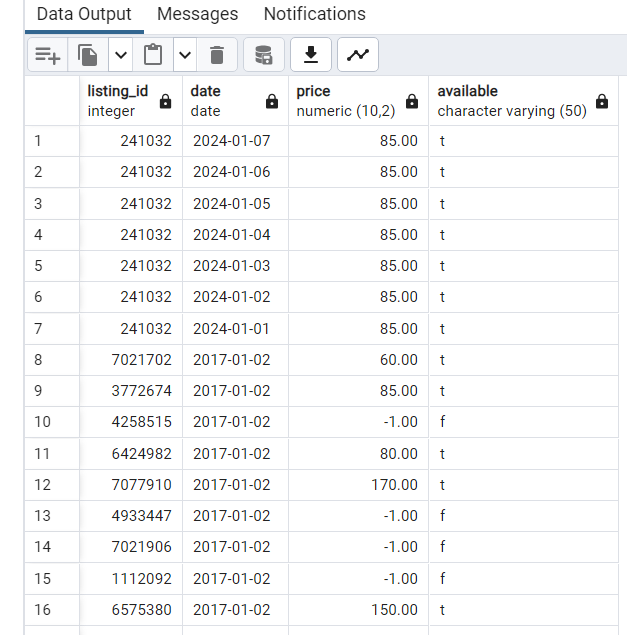

# Hands-on Lab: Working with the latest developer capabilities of Postgres 16

- [Hands-on Lab: Working with the latest developer capabilities of Postgres 16](#hands-on-lab-working-with-the-latest-developer-capabilities-of-postgres-16)
  - [Setup](#setup)
    - [Required Resources](#required-resources)
    - [Software pre-requisites](#software-pre-requisites)
  - [Exercise 1: Logical Replication](#exercise-1-logical-replication)
    - [Task 1: Setup Publication](#task-1-setup-publication)
    - [Task 2: Setup Subscriber](#task-2-setup-subscriber)
    - [Task 3: Sync Data](#task-3-sync-data)

In this lab, logical replication will be setup between two instances of Azure Database for PostgreSQL Flexible Server.

## Setup

### Required Resources

Several resources are required to perform this lab. These include:

- Azure Database for PostgreSQL Flexible Server (Version 14)
- Azure Database for PostgreSQL Flexible Server (Version 16)

Create these resources using the PostgreSQL Flexible Server Developer Guide Setup documentation:

- [Deployment Instructions](../../../11_03_Setup/00_Template_Deployment_Instructions.md)

### Software pre-requisites

All this is done already in the lab setup scripts for the Lab virtual machine but is provided here for reference.

- Install [pgAdmin](https://www.pgadmin.org/download/)

## Exercise 1: Logical Replication

### Task 1: Setup Publication

1. Assign the `REPLICATION` permission to the user in order to set up replication.  Run the following on the **pgsqldevSUFFIXflex16** server:

    ```sql
    ALTER ROLE wsuser WITH REPLICATION;
    ```

2. On the **pgsqldevSUFFIXflex16** server for the `airbnb` database, run the following to create a publication, add a table to it and then create a slot:

    ```sql
    create publication my_pub;
    
    alter publication my_pub add table listings;
    alter publication my_pub add table calendar;
    alter publication my_pub add table reviews;
    ```

### Task 2: Setup Subscriber

1. On the **pgsqldevSUFFIXflex14** server for the `airbnb` database, run the following.  It will set up the subscription (the tables should have been created from the lab setup). Be sure to replace the `PREFIX` and `REGION` values:

    ```sql
    CREATE SUBSCRIPTION my_pub_subscription CONNECTION 'host=pgsqldevSUFFIXflex16.postgres.database.azure.com port=5432 dbname=airbnb user=wsuser password=Solliance123' PUBLICATION my_pub WITH (copy_data=true, enabled=true, create_slot=true, slot_name='my_pub_slot');
    ```

### Task 3: Sync Data

1. On the **pgsqldevSUFFIXflex16** server, run the following to add some rows to the `calendar` table:

    ```sql
    INSERT INTO CALENDAR values (241032, '2024-01-01', 85, 't');
    INSERT INTO CALENDAR values (241032, '2024-01-02', 85, 't');
    INSERT INTO CALENDAR values (241032, '2024-01-03', 85, 't');
    INSERT INTO CALENDAR values (241032, '2024-01-04', 85, 't');
    INSERT INTO CALENDAR values (241032, '2024-01-05', 85, 't');
    INSERT INTO CALENDAR values (241032, '2024-01-06', 85, 't');
    INSERT INTO CALENDAR values (241032, '2024-01-07', 85, 't');
    ```

2. On the **pgsqldevSUFFIXflex14** server, run the following, and notice that the row has replicated from 16 to 14 instance:

    ```sql
    SELECT * 
    FROM calendar
    ORDER BY date desc
    limit 50;
    ```

    
