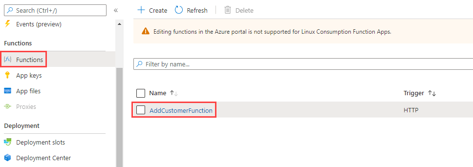
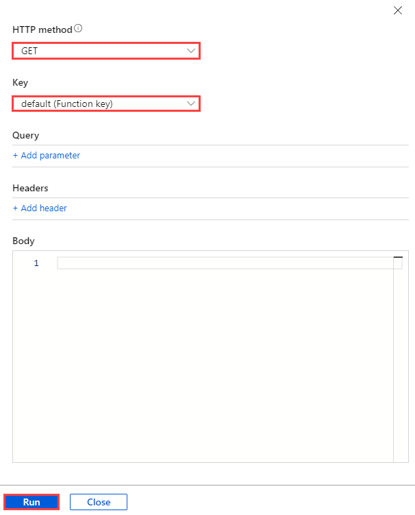

# Hands-on Lab: Azure Function with PostgreSQL (Python)

In this hands-on lab, an HTTP Function Application will be created using Visual Studio Code and Python. The HTTP Function Application will connect to an Azure Database for PostgreSQL Flexible Server and display database information.

## Setup

### Required Resources

Several resources are required to perform this lab. These include:

- Azure App Service Plan (Linux)
- Azure App Service (Linux)
- Azure Database for PostgreSQL Flexible Server

Create these resources using the PostgreSQL Flexible Server Developer Guide Setup documentation:

- [Deployment Instructions](../../../11_03_Setup/00_Template_Deployment_Instructions.md)

Clone of the PostgreSQL Developer Guide Repo to `c:\labfiles`:

- [TODO]()

### Software pre-requisites

All this is done already in the lab setup scripts for the Lab virtual machine but is provided here for reference.

- Install [Visual Studio Code](https://code.visualstudio.com/download)
- Install the [`Azure Functions`](https://marketplace.visualstudio.com/items?itemName=ms-azuretools.vscode-azurefunctions) extension
- Install the [`Python`](https://marketplace.visualstudio.com/items?itemName=ms-python.python) extension
- Install [Python 3.11.x](https://www.python.org/downloads/)
- Install the [Azure Functions core tools MSI](https://go.microsoft.com/fwlink/?linkid=2174087)

## Exercise 1: Create the Function Application

The application here is based on an HTTP Trigger that will then make a call into the Azure Database for PostgreSQL Flexible Server instance and add some records. To create this function perform the following steps.

- Open Visual Studio Code, type **Ctrl-Shift-P**
- Select **Azure Functions: Create New Project**

    

- Select the project path (ex `c:\temp\python-function`)
- For the language, select **Python**
- For the model, select **Model V2**
- Select the **python 3.11.x** option
- Select the **HTTP trigger**

    

- For the name, type **ShowDatabasesFunction**, press **ENTER**
- For the authorization level, select **FUNCTION**
- Select **Open in current window**
- Update the function code in `function_app.py` to the following, ensuring that the connection information is replaced. This Function completes the following tasks when its HTTP endpoint receives a request:
  - Connecting to the PostgreSQL Flexible Server instance provisioned in the ARM template
  - Generating a list of databases on the PostgreSQL instance
  - Building a formatted response
  - Returning the formatted response to the caller

```python
import logging
import azure.functions as func
import psycopg2
import ssl

app = func.FunctionApp(http_auth_level=func.AuthLevel.FUNCTION)

@app.route(route="ShowDatabasesFunction")
def ShowDatabasesFunction(req: func.HttpRequest) -> func.HttpResponse:
    logging.info('Python HTTP trigger function processed a request.')

    crtpath = 'BaltimoreCyberTrustRoot.crt.pem'
    #crtpath = 'DigiCertGlobalRootCA.crt.pem'

    ctx = ssl.SSLContext(ssl.PROTOCOL_TLSv1_2)

    # Connect to PostgreSQL
    cnx = psycopg2.connect(database="postgres",
        host="pgsqldevSUFFIXflex16.postgres.database.azure.com",
        user="wsuser",
        password="Solliance123",
        port="5432")

    logging.info(cnx)
    # Show databases
    cursor = cnx.cursor()
    cursor.execute("SELECT datname FROM pg_catalog.pg_database;")
    result_list = cursor.fetchall()
    # Build result response text
    result_str_list = []
    for row in result_list:
        row_str = ', '.join([str(v) for v in row])
        result_str_list.append(row_str)
    result_str = '\n'.join(result_str_list)
    return func.HttpResponse(
        result_str,
        status_code=200
    )
```

- Open a terminal window (Select **Terminal->New Terminal**)
  - Install the PostgreSQL connector:

    ```powershell
    pip install psycopg2
    ```

    

  - Run the function app (press `F5`):

    ```powershell
    func start run
    ```

- In the dialog, select **Allow**
- Open a browser window to the following. A list of databases should load:

    ```text
    http://localhost:7071/api/ShowDatabasesFunction
    ```

- The data will be displayed, however, it will be over the non-SSL connection. Azure recommends that Flexible Server clients use the service's public SSL certificate for secure access. Download the [Azure SSL certificate](https://www.digicert.com/CACerts/BaltimoreCyberTrustRoot.crt.pem) to the Function App project root directory
- Add the following lines to the Python code to utilize the Flexible Server public certificate and support connections over TLS 1.2:

```python
crtpath = '../BaltimoreCyberTrustRoot.crt.pem'
#crtpath = '../DigiCertGlobalRootCA.crt.pem' #THIS IS THE OLD CERT, USE THE BALTIMORE CERT

ctx = ssl.SSLContext(ssl.PROTOCOL_TLSv1_2)

# Connect to PostgreSQL
cnx = psycopg2.connect(database="postgres",
        host="pgsqldevSUFFIXflex16.postgres.database.azure.com",
        user="wsuser",
        password="Solliance123",
        port="5432",
        sslmode='require',
        sslrootcert=crtpath)
```

- Call the endpoint again in a browser. The Function App should still operate

## Exercise 2: Deploy the Function Application

Now that the Function App is created and working locally, the next step is to publish the Function App to Azure. This will require some small changes.

- Add the following to the Python code:

```Python
import pathlib

def get_ssl_cert():
    current_path = pathlib.Path(__file__).parent.parent
    return str(current_path / 'BaltimoreCyberTrustRoot.crt.pem')
```

- Modify the `ssl_ca` parameter to call the `get_ssl_cert()` function and get the certificate file path

```python
ssl_ca=get_ssl_cert(),
```

- Open the `requirements.txt` file and modify it to the following. The Azure Functions runtime will install the dependencies in this file

```text
azure-functions
psycopg2
```

- Switch to the terminal window and run the following. Follow the instructions to log in to the Azure subscription:

```PowerShell
az login
```

- If necessary, switch to the target subscription:

```PowerShell
az account set --subscription 'SUBSCRIPTION NAME'
```

- Switch to the terminal window and run the following from the repository root:

```PowerShell
func azure functionapp publish pgsqldevSUFFIX-ShowDatabasesFunction
```

- If the previous dotnet version was deployed, then an error about the function runtime should be displayed. Run the following to force the deployment and change the runtime to Python:

```PowerShell
az functionapp config set --name pgsqldevSUFFIX-ShowDatabasesFunction --resource-group RESOURCEGROPUNAME --linux-fx-version '"Python|3.11"'
```

- Retry the deployment:

```PowerShell
func azure functionapp publish pgsqldevSUFFIX-ShowDatabasesFunction --force
```

## Exercise 3: Test the Function App in the Azure portal

- Navigate to the Azure portal and select **ShowDatabasesFunction** from the **PostgreSQLdev[SUFFIX]-ShowDatabasesFunction** Function App instance

    

- On the **ShowDatabasesFunction** page, **Code + Test**. Then, select **Test/Run** to access the built-in testing interface
- Issue a simple GET request to the Function App endpoint.

    > **NOTE** It is possible to use a *function key*, which is scoped to an individual Function App, or a *host key*, which is scoped to an Azure Functions instance.

    

- The Function App should execute successfully, with logs indicating a successful connection to PostgreSQL Flexible Server

    

## Troubleshooting

- If the Function App works locally but fails in the cloud, ensure that the Azure environment is configured properly:
  - The `requirements.txt` file must reference the PostgreSQL Python connector
  - The Flexible Server instance must provide access to all Azure resources
  - The Azure Function Apps instance must be using extension version `4`, as that is what the local core tools support
