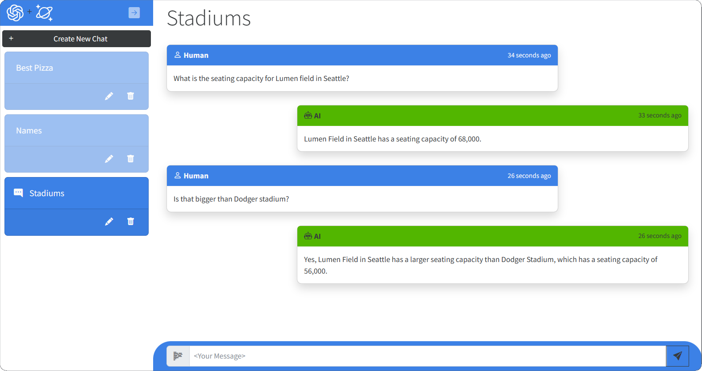

# PostgreSQL + OpenAI ChatGPT

This sample application combines PostgreSQL with OpenAI ChatGPT with a Blazor Server front-end for an intelligent chatbot application that shows off how to build a simple chat application with OpenAi ChatGPT and PostgreSQL.

## Features

This application has individual chat sessions which are displayed and can be selected in the left-hand nav. Clicking on a session will show the messages that contain human prompts and AI completions.

When a new prompt is sent to the Azure OpenAI service, some of the conversation history is sent with it. This provides context allowing ChatGPT to respond as though it is having a conversation. The length of this conversation history can be configured from appsettings.json with the `OpenAiMaxTokens` value which is then translated to a maximum conversation string length that is 1/2 of this value.

Please note that the "text-davinci-003" model used by this sample has a maximum of 4096 tokens. Tokens are used in both the request and response from the service. Overriding the maxConversationLength to values approaching the maximum token value could result in completions that contain little to no text if all of it has been used in the request.

The history for all prompts and completions for each chat session is stored in PostgreSQL. Deleting a chat session in the UI will delete its corresponding data as well.

The application will also summarize the name of the chat session by asking ChatGPT to provide a one or two-word summary of the first prompt. This allows for the easy identification of different chat sessions.

Please note this is a sample application. It is intended to demonstrate how to use PostgreSQL and Azure OpenAI ChatGPT together. It is not intended for production or other large-scale use

## Getting Started

### Prerequisites

- Azure Subscription
- Subscription access to Azure OpenAI service. Start here to [Request Access to Azure OpenAI Service](https://customervoice.microsoft.com/Pages/ResponsePage.aspx?id=v4j5cvGGr0GRqy180BHbR7en2Ais5pxKtso_Pz4b1_xUOFA5Qk1UWDRBMjg0WFhPMkIzTzhKQ1dWNyQlQCN0PWcu)
- Visual Studio, VS Code, or some editor to edit or view the source for this sample.

### Installation

1. Fork this repository to a GitHub account.
1. Depending on how using the ARM Template or Bicep, modify this variable in one of those files to point to the fork of this repository, "webSiteRepository": "https://github.com/Azure-Samples/cosmosdb-chatgpt.git"
1. If using the Deploy to Azure button below, also modify this README.md file to change the path for the Deploy To Azure button to the local repository.
1. If you deploy this application without making either of these changes, you can update the repository by disconnecting and connecting an external git repository pointing to the fork.

The provided ARM or Bicep Template will provision the following resources:
1. Azure Database for PostgreSQL Flexible Server.
1. Azure App service. This will be configured for CI/CD to the forked GitHub repository. This service can also be configured to run on App Service free tier.
1. Azure Open AI account. You must also specify a name for the deployment of the "text-davinci-003" model which is used by this application.

Note: You must have access to Azure Open AI service from the subscription before attempting to deploy this application.

All connection information for PostgreSQL and Open AI is zero-touch and injected as environment variables in the Azure App Service instance at deployment time.

### Quickstart

1. After deployment, go to the resource group for the deployment and open the Azure App Service in the Azure Portal. Click the web url to launch the website.
1. Click + New Chat to create a new chat session.
1. Type a question in the text box and press Enter.

## Clean up

To remove all the resources used by this sample, first manually delete the deployed model within the Azure AI service. Then delete the resource group for the deployment. This will delete all remaining resources.

## Resources

- [Open AI Platform documentation](https://platform.openai.com/docs/introduction/overview)
- [Azure Open AI Service documentation](https://learn.microsoft.com/azure/cognitive-services/openai/)
