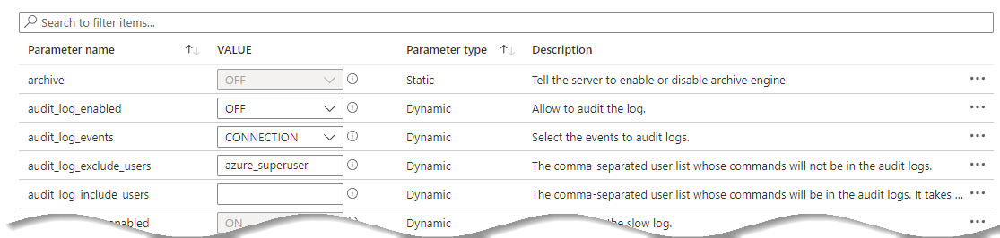

# 08 / Performance and Optimization

After organizations migrate their PostgreSQL workloads to Azure, they unlock turnkey performance monitoring solutions, scalability, and the benefits of Azure's global footprint. Operation teams must establish performance baselines before fine-tuning their PostgreSQL instances to ensure that changes, especially those that require application downtime, are worth doing. If you can, **simulate your workload in a test environment** and make adjustments in test before implementing changes in a production environment.

Before jumping into specific and time consuming performance enhancements/investigation, there are some general tips that can improve performance in your environment that this section will explore.

## General performance tips

The following are some basic tips for how to increase or ensure the performance of your Azure Database for PostgreSQL Flexible Server applications and database workloads:

- Ensure the input/output operations per second (IOPS) are sufficient for the application needs. Keep the IO latency low.
- Create and tune the table indexes. Avoid full table scans.
- Performance regular database maintenance.
- Make sure the application/clients (e.g. App Service) are physically located as close as possible to the database. Reduce network latency.
- Use accelerated networking for the application server if you use a Azure virtual machine, Azure Kubernetes, or App Services.
- Use connection pooling when possible. Avoid creating new connections for each application request. ProxySQL for built-in connection pooling and load balancing. Balance your workload to multiple read replicas as demand requires without any changes in application code.
- Set timeouts when creating transactions.
- Set up a read replica for read-only queries and analytics.
- Consider using query caching solution like Heimdall Data Proxy. Limit connections based on per user and per database. Protect the database from being overwhelmed by a single application or feature.
- Temporarily scale your Azure Database for PostgreSQL Flexible Server resources for taxing tasks. Once your task is complete, scale it down.

## Monitoring hardware and query performance

As previously discussed in the monitoring section of this guide, monitoring metrics such as the `cpu_percent` or `memory_percent` can be important when deciding to upgrade the database tier. Consistently high values for extended periods of time could indicate a tier upgrade is necessary.

If CPU and memory do not seem to be the issue, administrators can explore database-based options such as indexing and query modifications for poor-performing queries.

To find poor-performing queries, run the following:

```kql
AzureDiagnostics
| where ResourceProvider == "MICROSOFT.DBFORPostgreSQL"
| where Category == 'PostgreSQLSlowLogs'
| project TimeGenerated, LogicalServerName_s, event_class_s, start_time_t , query_time_d, sql_text_s
| top 5 by query_time_d desc
```

## Upgrading the tier

*Know your workload!* The Azure portal and the CLI can be used to scale between the `Burstable`, `General Purpose`, and `Memory Optimized` tiers. Tier scaling requires restarting the Flexible Server instance, causing 60-120 seconds of downtime. If your application does not require a significant compute, use the `Burstable` SKU. When your application requires more performance during certain times, Azure Database for PostgreSQL Flexible Server can increase performance automatically and reduce when you do not need it. Organizations can save operational costs.

## Scaling the server

Within the tier, it is possible to scale cores and memory to the minimum and maximum [limits](https://learn.microsoft.com/azure/postgresql/flexible-server/concepts-pricing-tiers) allowed in that tier. If monitoring shows a continual maxing out of CPU or memory, scale up to meet demand.

You can also adjust the IOPS for better transactions per second (TPS) performance. You can use an [Azure CLI script](https://learn.microsoft.com/azure/postgresql/flexible-server/flexible-server/scripts/sample-cli-monitor-and-scale) to monitor relevant metrics and scale the server.

## Azure Database for PostgreSQL Flexible Server memory recommendations

An Azure Database for PostgreSQL Flexible Server performance best practice is to allocate enough RAM so that your working set resides almost completely in memory. Check if the memory percentage used is reaching the limits.

Do not be surprised. Set up alerts on thresholds to ensure that notifications can be sent to administrators before servers reach limits. Based on the defined limits, check if scaling the database SKU to a higher compute size or to a better pricing tier increases performance enough to meet the workload requirements.

For information on monitoring a DB instance's metrics, see [PostgreSQL DB Metrics](https://learn.microsoft.com/azure/postgresql/flexible-server/concepts-monitoring#metrics).

## Moving regions

It is possible to move a geo-redundant Flexible Server instance to a [paired Azure region](https://docs.microsoft.com/azure/availability-zones/cross-region-replication-azure) through geo-restore. Geo-restore creates a new Flexible Server instance in the paired Azure region based on the current state of the database.

> **Note:** Point-in-time restore is not supported.

Geo-restore can be used to recover from a service outage in the primary region. However, the Flexible Server instance created in the paired region can only be configured with locally redundant storage, as its paired region (the old primary region) is down.

To minimize downtime, Flexible Server configuration settings can be kept intact.

## Server parameters

As a managed service for Postgres, the configurable parameters in Azure Database for PostgreSQL are a subset of the parameters in a local Postgres instance (For more information on Postgres parameters, see the PostgreSQL documentation). Your Azure Database for PostgreSQL server is enabled with default values for each parameter on creation. Some parameters that would require a server restart or superuser access for changes to take effect cannot be configured by the user.



As part of the migration, the on-premises [server parameters](https://learn.microsoft.com/azure/postgresql/flexible-server/flexible-server/concepts-server-parameters) were likely modified to support a fast egress. Also, modifications were made to the Azure Database for PostgreSQL Flexible Server parameters to support a fast ingress. The Azure server parameters should be set back to their original on-premises workload-optimized values after the migration.

However, be sure to review and make server parameter changes that are appropriate for the workload and the environment. Some values that were great for an on-premises environment may not be optimal for a cloud-based environment. When migrating the current on-premises parameters to Azure, verify that they can be set.

Some Azure Database for PostgreSQL Flexible Server parameters cannot be modified. Verify the strategy before making environment assumptions.

## Upgrade Azure Database for PostgreSQL Flexible Server versions

Sometimes, just upgrading versions may be the solution to an issue. Flexible Server currenlty supports PostgreSQL versions 11 through 16. Migrating from on-premises PostgreSQL to PostgreSQL Flexible Server 16 delivers some major performance improvements.

## Customizing the container runtime

When using containers for your PostgreSQL and PHP application, the platform choice has a huge impact on your performance limits. In most cases, creating a custom PHP container can improve performance up to 6x over the out-of-the-box official PHP containers.  It is important to determine if the effort of building a custom image will be worth the performance gain from the work.  Also, keep in mind recent versions of PHP tend to perform better than older versions.

Custom environments can be tested against standard workloads by running various benchmarks using the [PHPBench tool](https://github.com/phpbench/phpbench).

  [Container insights overview](https://docs.microsoft.com/azure/azure-monitor/containers/container-insights-overview)

## Running PostgreSQL Benchmarks

There are several tools that can be used to benchmark PostgreSQL environments. Here are a few that can be used to determine how well an instance is performing:

- [DBT2 Benchmark](https://downloads.PostgreSQL.com/source/dbt2-0.37.50.16.tar.gz) - DBT2 is an open source benchmark that mimics an OLTP application for a company owning large amounts of warehouses. It contains transactions to handle New Orders, Order Entry, Order Status, Payment and Stock handling

- [SysBench Benchmark Tool](https://downloads.PostgreSQL.com/source/sysbench-0.4.12.16.tar.gz) - Sysbench is a popular open source benchmark to test open source DBMSs.

More Common sets of tests typically utilize TPC benchmarks such as [TPC-H](https://www.tpc.org/tpch/) but there are many more [types of tests](https://www.tpc.org/information/benchmarks5.asp) that can be run against the PostgreSQL environment to test against specific workloads and patterns.