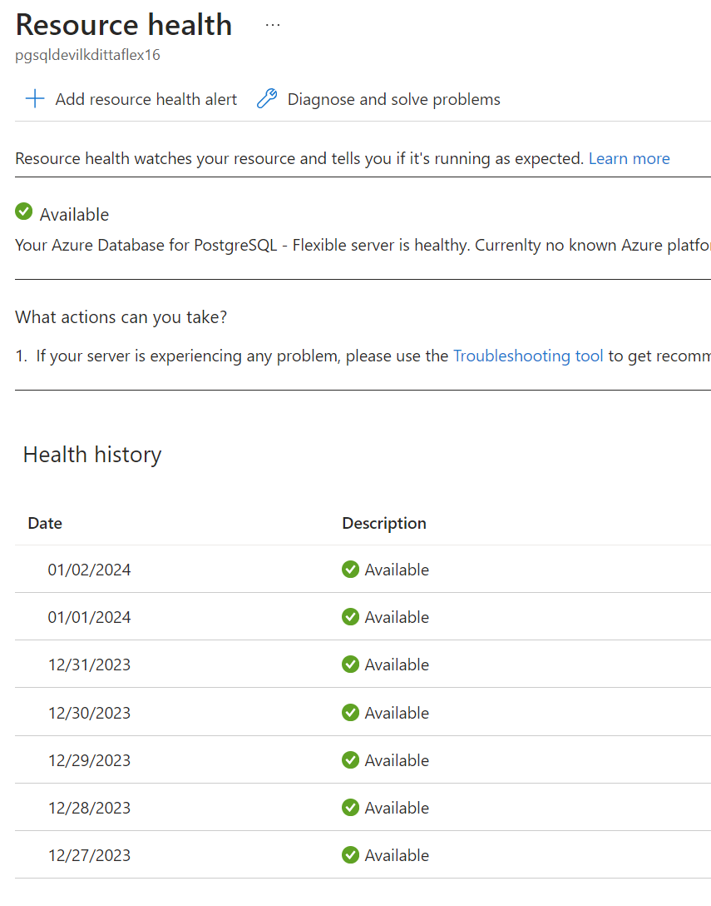

# 09 / Troubleshooting

As applications are running and executing in cloud environments, it is always a possibility that something unexpected can occur. This chapter covers a few common issues and the troubleshooting steps for each issue.

## Common PostgreSQL issues

Debugging operational support issues can be time consuming. Configuring the right monitoring and alerting can help provide useful error messages and clues to the potential problem area(s).

### Connectivity issues

Both server misconfiguration issues and network access issues can prevent clients from connecting to an Azure Database for PostgreSQL Flexible Server instance. For some helpful connectivity suggestions, reference the [Troubleshoot connection issues to Azure Database for PostgreSQL Flexible Server](https://learn.microsoft.com/azure/postgresql/flexible-server/how-to-troubleshoot-common-connection-issues) and [Handle transient errors and connect efficiently to Azure Database for PostgreSQL Flexible Server](https://learn.microsoft.com/azure/postgresql/flexible-server/concepts-connectivity) articles.

#### Outdataed Azure CLI

Always ensure that you are running the latest Azure CLI.  If using older versions, you can run into issues such as:

- `The parameter PrivateDnsZoneArguments is required, and must be provided by customer``, this means you may be running an older version of Azure CLI. 

You can upgrade your Azure CLI by executing the following if your currency version is `2.11.0` or higher:

```powershell
az upgrade
```

#### Misconfiguration

- Administrators use the database admin user specified during server creation to create new databases and add new users. If the admin user credentials were not recorded, administrators can easily reset the admin password using the Azure portal.
  - Logging in with the administrator account can help debug other access issues, like confirming if a given user exists.

#### SSL Connectivity

Most on-premises applications that are migrated to cloud-based services will not have the supporting connection string information for SSL based connections.  In most cases, you will need to download the SSL certificate for the server(s) and include them as part of your application deployments.

SSL certificate best practice is to expire these certifcates on a set period.  If you have migrated your applications to use SSL, ensure that the certificate is valid.  You should put an event in the operations calendar that will let administrators and developers know that the SSL certificate is going to expire.

For more information, review [Understanding the changes in the Root CA change for Azure Database for PostgreSQL Single server](https://learn.microsoft.com/azure/postgresql/single-server/concepts-certificate-rotation).

#### Network access issues

- By default, Flexible Server only supports encrypted connections through the TLS 1.2 protocol; clients using TLS 1.0 or 1.1 will be unable to connect unless explicitly enabled. If it is not possible to change the TLS protocol used by an application, then [change the Flexible Server instance's supported TLS versions.](https://learn.microsoft.com/azure/postgresql/flexible-server/how-to-connect-tls-ssl)

- If connecting to Flexible Server via public access, ensure that firewall ACLs permit access from the client.

- Ensure that corporate firewalls do not block outbound connections to port 5432/6432.

- Use a fully qualified domain name instead of an IP address in connection strings.

- Use [Azure Network Watcher](https://docs.microsoft.com/azure/network-watcher/network-watcher-monitoring-overview) to debug traffic flows in virtual networks. 
  
  > **Note:** It does not support PaaS services, but it is still a helpful tool for IaaS configurations
  
  - Network Watcher works well with other networking utilities, like the Unix `traceroute` tool

### Resource issues

If the application experiences transient connectivity issues, perhaps the resources of the Azure Database for PostgreSQL Flexible Server instance are constrained. Monitor resource usage and determine whether the instance needs to be scaled up.  

There are several troubleshooting tools available for Azure Database for PostgreSQL that focus on resource analysis. Some items that are coverd include:

- High CPU Usage
- High Memory Usage
- High IOPS Usage
- High Temporary Files
- Autovacuum Monitoring
- Autovacuum Blockers

For the latest information, reference [Troubleshooting guides for Azure Database for PostgreSQL - Flexible Server](https://learn.microsoft.com/azure/postgresql/flexible-server/concepts-troubleshooting-guides).

Additionally, you can utilize the monitoring metrics to further investigate any resource related issues.  Reference [Monitor metrics on Azure Database for PostgreSQL - Flexible Server](https://learn.microsoft.com/azure/postgresql/flexible-server/concepts-monitoring) for more information.

### Unsupported PostgreSQL features

Operating in a cloud environment means that certain features that function on-premises are incompatible with Azure Database for PostgreSQL Flexible Server instances. While Flexible Server has better feature parity with on-premises PostgreSQL than Single Server, it is important to be aware of any limitations.

- Azure Database for PostgreSQL Flexible Server does not support the PostgreSQL super user privilege. This may affect how some applications operate.

- Direct file system access is not available to clients.

Also reference [Limits in Azure Database for PostgreSQL - Flexible Server](https://learn.microsoft.com/azure/postgresql/flexible-server/concepts-limits) for the latest information.

### Transient errors

A best practice for designing and developing applications in the cloud is to expect transient errors. Assume they can happen in any component at any time and to have the appropriate logic in place to handle these situations.

For more information, reference [Handling transient connectivity errors for Azure Database for PostgreSQL - Flexible Server](https://learn.microsoft.com/azure/postgresql/flexible-server/concepts-connectivity).

### Platform issues

- On occasion, Azure experiences outages. Use [Azure Service Health](https://azure.microsoft.com/features/service-health/) to determine if an Azure outage impacts PostgreSQL workloads in your region or datacenter.

- Azure's periodic updates can impact the availability of applications. Flexible Server allows administrators [to set custom maintenance schedules.](https://learn.microsoft.com/azure/postgresql/flexible-server/concepts-maintenance)

- Implement retry logic in your applications to mitigate transient connectivity issues:
  
  - To provide resiliency against more severe failures, like Azure service outages, implement the [circuit breaker pattern](https://docs.microsoft.com/azure/architecture/patterns/circuit-breaker) to avoid wasting application resources on operations that are likely to fail

## Troubleshoot app issues in Azure App Service

- **Enable web logging.** Azure provides built-in diagnostics to assist with [debugging an App Service app](https://docs.microsoft.com/azure/app-service/troubleshoot-diagnostic-logs).
- Network requests taking a long time? [Troubleshoot slow app performance issues in Azure App Service](https://docs.microsoft.com/azure/app-service/troubleshoot-performance-degradation)
- In Azure App Service, certain settings are available to the deployment or runtime environment as environment variables. Some of these settings can be customized when configuring the app settings.
[Environment variables and app settings in Azure App Service](https://docs.microsoft.com/azure/app-service/reference-app-settings?tabs=kudu%2Cdotnet)

- [Azure App Service on Linux FAQ](https://docs.microsoft.com/azure/app-service/faq-app-service-linux)

## App debugging

Following software development best practices makes your code simpler to develop, test, debug, and deploy. Here are some strategies to resolve application issues.

- Use logging utilities wisely to help troubleshoot failures without impairing app performance. Structured logging utilities, like PHP's native logging functions or third-party tools, such as [KLogger](https://github.com/katzgrau/KLogger), can write logs to the console, to files, or to central repositories. Monitoring tools can parse these logs and alert anomalies.

- In development environments, remote debugging tools like [XDebug](https://xdebug.org/docs/) may be useful. You can set breakpoints and step through code execution. [Apps running on Azure App Service PHP and Container instances can take advantage of XDebug.](https://azureossd.github.io/2020/05/05/debugging-php-application-on-azure-app-service-linux/)
  
  - Users of Visual Studio Code can install XDebug's [PHP Debug extension](https://marketplace.visualstudio.com/items?itemName=xdebug.php-debug).

- To debug slow PHP applications, consider using Application Performance Monitoring solutions like [Azure Application Insights](https://docs.microsoft.com/azure/azure-monitor/app/app-insights-overview), which integrates with Azure Monitor. Here are a few common culprits for low-performing PHP apps.
  - Executing database queries against tables that are indexed inefficiently
  - Configuring web servers poorly, such as by choosing a suboptimal number of worker processes to serve user requests
  - Disabling [opcode caching](https://www.php.net/manual/en/intro.opcache.php), requiring PHP to compile code files to opcodes every request

- Write tests to ensure that applications function as intended when code is modified. Review the [07 / Testing] document for more information about different testing strategies. Tests should be included in automated release processes.

- Generally, all cloud applications should include connection [retry logic](https://docs.microsoft.com/azure/architecture/patterns/retry), which typically responds to transient issues by initiating subsequent connections after a delay.

### Additional support

- In the Azure portal, navigate to the **Diagnose and solve problems** tab of your Azure Database for PostgreSQL Flexible Server instance for suggestions regarding common connectivity, performance, and availability issues.

  

  This experience integrates with Azure Resource Health to demonstrate how Azure outages affect your provisioned resources.

  

- If none of the above resolve the issue with the PostgreSQL instance, [send a support request from the Azure portal.](https://portal.azure.com/#blade/Microsoft_Azure_Support/HelpAndSupportBlade/overview)

### Opening a support ticket

If you need assistance with an Azure Database for PostgreSQL Flexible Server issue, [open an Azure support ticket](https://portal.azure.com/#blade/Microsoft_Azure_Support/HelpAndSupportBlade/overview) with Microsoft.  Be sure to select the correct product and provide as much information as possible, so the proper resources is assigned to your ticket.


### Recommended content

- [Troubleshoot connection issues to Azure Database for PostgreSQL - flexible Server](https://learn.microsoft.com/azure/postgresql/flexible-server/how-to-troubleshoot-common-connection-issues)

- [Use the Troubleshooting guides for Azure Database for PostgreSQL - Flexible Server](https://learn.microsoft.com/azure/postgresql/flexible-server/how-to-troubleshooting-guides)

- [Handle transient errors and connect efficiently to Azure Database for PostgreSQL Flexible Server](https://learn.microsoft.com/azure/postgresql/flexible-server/concepts-connectivity)

- [Troubleshoot data encryption in Azure Database for PostgreSQL Flexible Server](https://learn.microsoft.com/azure/postgresql/flexible-server/howto-data-encryption-troubleshoot)

- [Azure Community Support](https://azure.microsoft.com/support/community/) Ask questions, get answers, and connect with Microsoft engineers and Azure community experts
