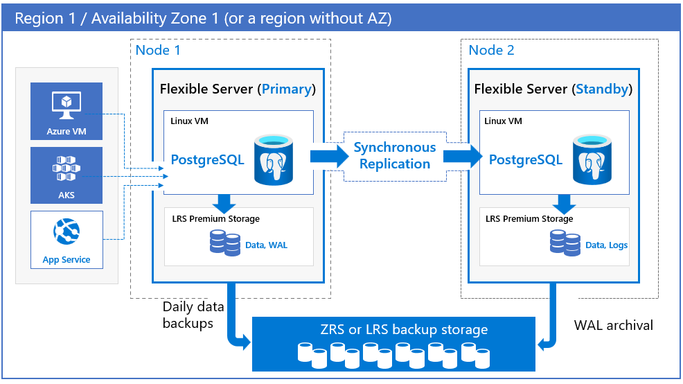
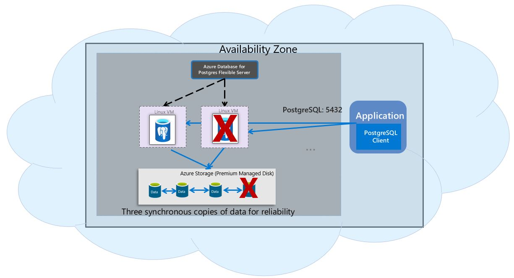

# 10 / Business Continuity and Disaster Recovery

Businesses implement *business continuity* (BC) and *disaster recovery* (DR) strategies to minimize disruptions. While *business continuity* emphasizes preserving business operations through policies, *disaster recovery* explains how IT teams will restore access to data and services.

As with any mission-critical system, having a backup and restore as well as a disaster recovery (BCDR) strategy is an important part of the overall system design.

If an unforeseen event occurs, administrators should have the ability to restore data to a point in time called the Recovery Point Objective (RPO) and in a reasonable amount of time called the Recovery Time Objective (RTO).

## Features

Azure Database for PostgreSQL Flexible Server offers several BCDR options that meets or exceeds any RPO or RTO objectives.  These include:

- Automatic backups
- Zone redundant high availability
- Same zone high availability
- Premium managed disks
- Zone redundant backup
- Geo-redundant backups
- Geo-Replication (Read replicas)

Reference [Overview of business continuity with Azure Database for PostgreSQL - Flexible Server](https://learn.microsoft.com/en-us/azure/postgresql/flexible-server/concepts-business-continuity) for the latest information.

## Planned versus Unplanned events

Planned events are ones that administrators are made aware of ahead of time whereas unplanned are outages that can occur without any notice.

Examples of planned downtime events include:

- Compute scaling
- Scaling up storage
- Software upgrades / maintence
- Minor version upgrades

Examples of unplanned events:

- Service outage
- Databse server failure
- Storage failure
- Logical/user errors
- Availablity zone failure
- Region failure

## High availability

The Azure Database for PostgreSQL Flexible Server deployment model is designed to support high availability with a myrid of different options.  This included within a single region (same and multi-zone) as well as across-regions.  Azure Database for PostgreSQL Flexible Server supports both zone-redundant and zonal models for high availability configurations. Both high availability configurations enable automatic failover capability with zero data loss during both planned and unplanned events.

If zone redundant high availability is configured, the service provisions and maintains standby replicas across the availability zone(s) within the same Azure region. The data changes on the source server are replicated to the replicas to ensure zero data loss. With zone redundant high availability, once the planned or unplanned failover event is triggered, a replica comes online and is then available to process incoming transactions. This allows the service resiliency from availability zone failure within an Azure region that supports multiple availability zones.

In terms of planned events, if high availability have been enabled, Flexible Server performs the scaling and the maintenance operations on the standby servers first.

Zone Redundant Architecture:

Zonal Architecture:

For the latest information, reference [High availability (Reliability) in Azure Database for PostgreSQL - Flexible Server](https://learn.microsoft.com/en-us/azure/reliability/reliability-postgresql-flexible-server).

### Prerequisities

There are some prerequisites that must be met in order to support high-availabilty options:

- Zone redundancy:
  -The zone-redundancy option is only available in regions that support availability zones.
  - Zone-redundancy is not supported for:
  - Azure Database for PostgreSQL – Single Server SKU.
  - Burstable compute tier.
  - Regions with single-zone availability.
- Zonal:
  - The zonal deployment option is available in all Azure regions where you can deploy Flexible Server.

### SLAs

When it comes to SLA of high availability options. Zonal model offers uptime SLA of 99.95% where as Zone-redundancy model offers uptime SLA of 99.99%.

### Implementing cross-region high availability (Built-in)

To utilize high-availability, you simply enable the feature via the Azure Portal, Azure CLI, or REST APIs.  Reference [Manage high availability in Flexible Server](https://learn.microsoft.com/en-us/azure/postgresql/flexible-server/how-to-manage-high-availability-portal).

### Implementing cross-region high availability (Customer managed)

It is possible to achieve cross-region availabliity using PostgreSQL native replication via logical replication with `pglogical` extension or logical decoding using WAL files.  Each option provides certain advantages and disadvantages.

For more information on how to utilize replication in Azure Database for PostgreSQL, reference [Logical replication and logical decoding in Azure Database for PostgreSQL - Flexible Server](https://learn.microsoft.com/en-us/azure/postgresql/flexible-server/concepts-logical).

When using Virtual Network integration, the virtual networks are peered to provide network connectivity for PostgreSQL native replication. Once peered and connected, developers can employ PostgreSQL native replication for scenarios like replicating from an on-premises primary to an Azure secondary.

One disadvantage of this architecture is that it is customer-managed and any failovers will come with manual steps unless you build out mitigation features.

### Running without High Availability

It is possible to configure your Flexible Server without high availability (azure or customer-managed) enabled. When running without HA the service provides local redundant storage with three copies of data, zone-redundant backup (in regions where it's supported), and built-in server resiliency to automatically restart a crashed server and relocate the server to another physical node. Uptime SLA of 99.9% is offered in this configuration. During planned or unplanned failover events, if the server goes down, the service maintains the availability of the servers using the following automated procedure:

- A new compute Linux VM is provisioned.
- The storage with data files is mapped to the new virtual machine.
- PostgreSQL database engine is brought online on the new virtual machine.

## Replication

Replication in Flexible Server allows applications to scale by providing **read-only** replicas to serve queries while dedicating write operations to the main Flexible Server instance.

Replication from the main instance to the read replicas is asynchronous. Consequently, there is a lag between the source instance and the replicas. Microsoft estimates that this lag typically ranges between a few seconds to a few minutes.

> **Warning:** Replication is not a high availability strategy.  Replication is designed to improve application performance, so **it does not support automatic failover or bringing replicas up to the latest committed transaction during failover**.

## Read replicas

[Read replicas](https://learn.microsoft.com/azure/postgresql/flexible-server/concepts-read-replicas) can be used to increase the PostgreSQL read throughput, improve performance for regional users, and implement disaster recovery. There is a cost. When creating one or more read replicas, be aware that additional charges will apply for the same compute and storage as the primary server.

Cross region read replicas can be deployed to protect your databases from region-level failures. Read replicas are updated asynchronously using PostgreSQL's physical replication technology, and can lag the primary. Read replicas are supported in general purpose and memory optimized compute tiers.

Read replicas are primarily designed for scenarios where offloading queries is beneficial, and a slight lag is manageable. They are optimized to provide near realtime updates from the primary for most workloads, making them an excellent solution for read-heavy scenarios. Analytical systems often benefit from read replicas. BI tools can connect to read replicas, while data is written to the main instance and replicated to the read replicas asynchronously.

### Promoting Replicas

If a need arises, you can promote a read replica to a primary replica role.  It is important to note that promote operations are not automatic. In the event of a primary server failure, the system won't switch to the read replica independently. An user action is always required for the promote operation.

For a successful promotion using the promote to primary server operation, both the primary and replica servers must have identical tiers and storage sizes. For instance, if the primary has 2vCores and the replica has 4vCores, the only viable option is to use the "promote to independent server and remove from replication" action. Additionally, they need to share the same values for server parameters that allocate shared memory.

Reference [Create and manage read replicas in Azure Database for PostgreSQL - Flexible Server from the Azure portal](https://learn.microsoft.com/en-us/azure/postgresql/flexible-server/how-to-read-replicas-portal) for more information on creating replicas and performing the failover operations.

### Virtual Endpoints

To alleviate the challenges of region and cross-region failover scenerios, Azure Database for PostgreSQL included the ability to create **Virtual Endpoints**.  Virtual Endpoints are read-write and read-only listener endpoints, that remain consistent irrespective of the current role of the PostgreSQL instance. This means you don't have to update your application's connection string after performing the promote to primary server action, as the endpoints will automatically point to the correct instance following a role change.

Virtual Endpoints offer two distinct types of connection points:

- Writer Endpoint (Read/Write): This endpoint always points to the current primary server. It ensures that write operations are directed to the correct server, irrespective of any promote operations users trigger. This endpoint can't be changed to point to a replica.

- Read-Only Endpoint: This endpoint can be configured by users to point either to a read replica or the primary server. However, it can only target one server at a time. Load balancing between multiple servers isn't supported. You can adjust the target server for this endpoint anytime, whether before or after promotion.

### Load Balancers

If the application is made up of many different client instances around the world, it may not be feasible to update all of the clients. When not using the built-in read replicas features, if you are required to failover to another instance, you will need to have something in place to help the clients adjust to the change. A load balancer or proxy may assist in this challenge.

Load balancing focuses on distributing load (incoming network traffic) across a group of backend resources or servers. Utilize an [Azure Load Balancer](https://learn.microsoft.com/azure/load-balancer/load-balancer-overview) or [Application Gateway](https://learn.microsoft.com/azure/application-gateway/overview) to implement a seamless failover functionality. Although helpful and time-saving, these tools are not required for regional failover capability.

## Regional failure

In case of a rare regional failure event (all availablity zones are down), geo-replication and geo-redundant backups can be used to get the data workloads running again. With the new geo-repolication capabilities it is a best practice to have a secondary region configured for the best protection against unexpected regional failures.

### Use fully qualified domain names in connection strings

- Use a fully qualified domain name instead of an IP address in connection strings. If network changes are made causing IP addresses to change, your application should be operational. Administrators should not have to locate and change dependent application configuration, especially during a recovery event.

Additionally, when using a geo-redundant backup strategy, the process of changing the database server region also means the endpoint will change and application configurations will need to be updated accordingly.

## Deleted servers

> **Warning:** If an administrator or bad actor deletes the server in the Azure Portal or via automated methods, all backups and read replicas will also be deleted after five days. [Resource locks](https://learn.microsoft.com/azure/azure-resource-manager/management/lock-resources) must be created on the Azure Database for PostgreSQL Flexible Server resource group to add an extra layer of deletion prevention to the instances.

If a server is deleted, you can restore it as long as you are within the five day window.  Reference [Restore a dropped Azure Database for PostgreSQL Flexible server](https://learn.microsoft.com/azure/postgresql/flexible-server/how-to-restore-dropped-server) for more information.

### Post Restore tasks

- Enable diagnostic logging
- Update / re-configure alerts to use new server
- Depending on the strategy, update application connection strings
- Verify all server configurations match the previous server (such as server parameters, extensions, etc)
- Ensure networking settings are setup
- Ensure any user logins and permissions are consistent

## Backup and restore

Azure Database for PostgreSQL - Flexible Server automatically performs regular backups of your server. You can then do a point-in-time recovery (PITR) within a retention period that you specify. The overall time to restore and recovery typically depends on the size of data and the amount of recovery to be performed.

### Backup

The flexible server service automatically creates server backups and stores them on the region's zone redundant storage (ZRS). Backups can restore your server to any point within the backup retention period. The default backup retention period is seven days. The retention can be optionally configured for up to 35 days. All backups are encrypted using AES 256-bit encryption.

These backup files can't be exported or used to create servers outside Azure Database for PostgreSQL - Flexible Server. For that purpose, you can use the PostgreSQL tools pg_dump and pg_restore/psql.

Backups on flexible servers are snapshot based. The first snapshot backup is scheduled immediately after a server is created. Snapshot backups are currently taken once daily. The first snapshot is a full backup and consecutive snapshots are differential backups.

Transaction log backups happen at varied frequencies, depending on the workload and when the WAL file is filled and ready to be archived. In general, the delay (recovery point objective, or RPO) can be up to 15 minutes.

Flexible Server provides up to 100 percent of your provisioned server storage as backup storage at no extra cost. Any additional backup storage that you use is charged in gigabytes per month.

Backups can be configured in three ways:

- Zone-redundant - This option is automatically chosen for regions that support availability zones. When the backups are stored in zone-redundant backup storage, multiple copies are not only stored within the same availability zone, but also replicated to another availability zone within the same region.
- Locally redundant - This option is automatically chosen for regions that don't support availability zones yet. When the backups are stored in locally redundant backup storage, multiple copies of backups are stored in the same datacenter.
- Geo-redundant - You can choose this option at the time of server creation. When the backups are stored in geo-redundant backup storage, in addition to three copies of data stored within the region where your server is hosted, the data is replicated to a geo-paired region. After a server is provisioned, you can't change the backup storage redundancy option.

### Restore

Redundancy (local or geo) must be configured during server creation. However, a geo-restore can be performed and allows the modification of these options during the restore process. Performing a restore operation will temporarily stop connectivity, and any applications will be down during the restore process.

During a database restore, any supporting items outside of the database will also need to be restored.  Review the migration process. See [Perform post-restore tasks](https://learn.microsoft.com/azure/postgresql/flexible-server/concepts-backup-restore#post-restore-tasks) for more information.

Lastly, note that performing a restore from a backup provisions a new Flexible Server instance. Most of the new server's configuration is inherited from the old server, though it depends on the type of restore performed.

Learn more about backup and restore in Flexible Server from the [Microsoft documentation.](https://learn.microsoft.com/azure/postgresql/flexible-server/concepts-backup-restore)

### Point in Time Restore

In Flexible Server, performing a PITR creates a new server in the same region as your source server, but you can choose the availability zone. It's created with the source server's configuration for the pricing tier, compute generation, number of virtual cores, storage size, backup retention period, and backup redundancy option. Also, tags and settings such as virtual networks and firewall settings are inherited from the source server.

The physical database files are first restored from the snapshot backups to the server's data location. The appropriate backup that was taken earlier than the desired point in time is automatically chosen and restored. A recovery process then starts by using WAL files to bring the database to a consistent state.

Using the transaction log backups allows you to restore based on:

- Latest restore point (now) - allows you to restore the server to the latest point in time.
- Custom restore points - This option allows you to choose any point in time within the retention period defined for this flexible server. The time is based in UTC.
- Fast restore points - Fastest restore is possible by directly choosing the timestamp from the list of backups.

When using high-availabity, you should consider that any user based errors will be replicated to the standby replicas. For example, if a user performs a destructful query such as an accidental drop of a table or incorrect data updates, these changes are replicated to the standby replica. You can't use standby to recover from such logical errors.

### Geo-redundant backup and restore

Geo-redundant backup and restore provide the ability to restore your server in a different region in the event of a disaster. It also provides at least 99.99999999999999 percent (16 nines) durability of backup objects over a year.

Geo-redundant backup can be configured only at the time of server creation. When the server is configured with geo-redundant backup, the backup data and transaction logs are copied to the paired region asynchronously through storage replication.

After you create a server, wait at least one hour before initiating a geo-restore. That allows the first set of backup data to be replicated to the paired region. The estimated time to recover the server (recovery time objective, or RTO) depends on factors like the size of the database, the last database backup time, and the amount of WAL to process until the last received backup data. The overall recovery time usually takes from a few minutes up to a few hours.

For more information on geo-redundant backup and restore, see [geo-redundant backup and restore](https://learn.microsoft.com/en-us/azure/postgresql/flexible-server/concepts-backup-restore#geo-redundant-backup-and-restore).

### Flexible Server resources

- [Frequently asked questions](https://learn.microsoft.com/en-us/azure/postgresql/flexible-server/concepts-backup-restore#frequently-asked-questions)
- [Point-in-time restore with Azure Portal](https://learn.microsoft.com/azure/postgresql/flexible-server/how-to-restore-server-portal)
- [Point-in-time restore with CLI](https://learn.microsoft.com/azure/postgresql/flexible-server/how-to-restore-server-cli)
- Video - [How to backup Azure PostgreSQL with long term retention using Azure Backup](https://www.youtube.com/watch?v=dxTizWAeip0&list=PLLasX02E8BPBogRWzOFx7LsqWl-EWeE9-&index=1)