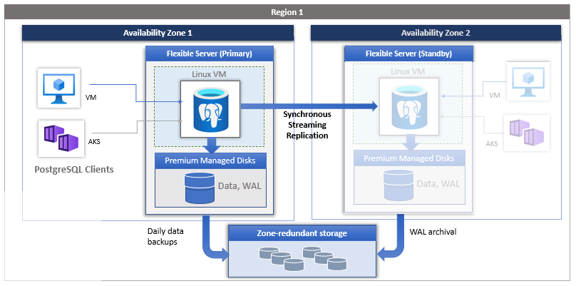

# 10 / Business Continuity and Disaster Recovery

Businesses implement *business continuity* (BC) and *disaster recovery* (DR) strategies to minimize disruptions. While *business continuity* emphasizes preserving business operations through policies, *disaster recovery* explains how IT teams will restore access to data and services.

## High availability

The flexible server deployment model is designed to support high availability within a single availability zone and across multiple availability zones. The architecture separates compute and storage. The database engine runs on a container inside a Linux virtual machine, while data files reside on Azure storage. The storage maintains three locally redundant synchronous copies of the database files ensuring data durability.

If zone redundant high availability is configured, the service provisions and maintains a warm standby server across the availability zone within the same Azure region. The data changes on the source server are synchronously replicated to the standby server to ensure zero data loss. With zone redundant high availability, once the planned or unplanned failover event is triggered, the standby server comes online immediately and is available to process incoming transactions. This allows the service resiliency from availability zone failure within an Azure region that supports multiple availability zones, as shown in the picture below.

### Implementing cross-region high availability

Flexible Server does not currently support cross-region high availability. However, it is possible to achieve this using PostgreSQL native replication instead of replicating log files at the Azure storage level. The image below demonstrates two Flexible Server instances deployed in two virtual networks in two Azure regions.

The virtual networks are peered to provide network connectivity for PostgreSQL native replication. As the image indicates, developers can employ PostgreSQL native replication for scenarios like replicating from an on-premises primary to an Azure secondary.

One disadvantage of this architecture is that it is customer-managed.

## Replication

Replication in Flexible Server allows applications to scale by providing **read-only** replicas to serve queries while dedicating write operations to the main Flexible Server instance.

Replication from the main instance to the read replicas is asynchronous. Consequently, there is a lag between the source instance and the replicas. Microsoft estimates that this lag typically ranges between a few seconds to a few minutes.

> **Warning:** Replication is not a high availability strategy. Consult the BCDR document for more details. Replication is designed to improve application performance, so **it does not support automatic failover or bringing replicas up to the latest committed transaction during failover**.

Replication is only supported in the General Purpose and Memory Optimized tiers of Flexible Server. Also, it is possible to promote a read replica to being a read-write instance. However, that severs the replication link between the main instance and the former replica, as the former replica cannot return to being a replica.

## Read replicas

[Read replicas](https://learn.microsoft.com/azure/postgresql/flexible-server/concepts-read-replicas) can be used to increase the PostgreSQL read throughput, improve performance for regional users, and implement disaster recovery. There is a cost. When creating one or more read replicas, be aware that additional charges will apply for the same compute and storage as the primary server.

## Deleted servers

> **Warning:** If an administrator or bad actor deletes the server in the Azure Portal or via automated methods, all backups and read replicas will also be deleted after five days. [Resource locks](https://learn.microsoft.com/azure/azure-resource-manager/management/lock-resources) must be created on the Azure Database for PostgreSQL Flexible Server resource group to add an extra layer of deletion prevention to the instances.

If a server is deleted, you can restore it as long as you are within the five day window.  Reference [Restore a dropped Azure Database for PostgreSQL Flexible server](https://learn.microsoft.com/azure/postgresql/flexible-server/how-to-restore-dropped-server) for more information.

## Regional failure

In case of a rare regional failure event, geo-redundant backups or a read replica can be used to get the data workloads running again. It is best to have both geo-replication and a read replica available for the best protection against unexpected regional failures.

> **Note:** Changing the database server region also means the endpoint will change and application configurations will need to be updated accordingly.

### Use fully qualified domain names in connection strings

- Use a fully qualified domain name instead of an IP address in connection strings. If network changes are made causing IP addresses to change, your application should be operational. Administrators should not have to locate and change dependent application configuration, especially during a recovery event.

## Load Balancers

If the application is made up of many different instances around the world, it may not be feasible to update all of the clients. A load balancer may assist in this challenge. Load balancing focuses on distributing load (incoming network traffic) across a group of backend resources or servers. Utilize an [Azure Load Balancer](https://learn.microsoft.com/azure/load-balancer/load-balancer-overview) or [Application Gateway](https://learn.microsoft.com/azure/application-gateway/overview) to implement a seamless failover functionality. Although helpful and time-saving, these tools are not required for regional failover capability.

### Use cases

#### Load balancer

TODO

> **Tip:** Moreover, analytical systems often benefit from read replicas. BI tools can connect to read replicas, while data is written to the main instance and replicated to the read replicas asynchronously.

#### Read replicas

Using read replicas also helps with microservice architecture implementations. The image below demonstrates how APIs that require read-only access data can connect to read replicas. APIs that modify data can use the primary database instance.

## Flexible Server resources

- [Azure Portal](https://learn.microsoft.com/azure/postgresql/flexible-server/how-to-read-replicas-portal?tabs=portal)

## Backup and restore

As with any mission-critical system, having a backup and restore as well as a disaster recovery (BCDR) strategy is an important part of the overall system design.

If an unforeseen event occurs, administrators should have the ability to restore data to a point in time called the Recovery Point Objective (RPO) and in a reasonable amount of time called the Recovery Time Objective (RTO).

Azure Database for PostgreSQL - Flexible Server automatically performs regular backups of your server. You can then do a point-in-time recovery (PITR) within a retention period that you specify. The overall time to restore and recovery typically depends on the size of data and the amount of recovery to be performed.

### Backup

The flexible server service automatically creates server backups and stores them on the region's zone redundant storage (ZRS). Backups can restore your server to any point within the backup retention period. The default backup retention period is seven days. The retention can be optionally configured for up to 35 days. All backups are encrypted using AES 256-bit encryption.

These backup files can't be exported or used to create servers outside Azure Database for PostgreSQL - Flexible Server. For that purpose, you can use the PostgreSQL tools pg_dump and pg_restore/psql.

Backups on flexible servers are snapshot based. The first snapshot backup is scheduled immediately after a server is created. Snapshot backups are currently taken once daily. The first snapshot is a full backup and consecutive snapshots are differential backups.

Transaction log backups happen at varied frequencies, depending on the workload and when the WAL file is filled and ready to be archived. In general, the delay (recovery point objective, or RPO) can be up to 15 minutes.

Flexible Server provides up to 100 percent of your provisioned server storage as backup storage at no extra cost. Any additional backup storage that you use is charged in gigabytes per month.

### Restore

Redundancy (local or geo) must be configured during server creation. However, a geo-restore can be performed and allows the modification of these options during the restore process. Performing a restore operation will temporarily stop connectivity, and any applications will be down during the restore process.

During a database restore, any supporting items outside of the database will also need to be restored.  Review the migration process. See [Perform post-restore tasks](https://learn.microsoft.com/azure/postgresql/flexible-server/concepts-backup-restore#post-restore-tasks) for more information.

Lastly, note that performing a restore from a backup provisions a new Flexible Server instance. Most of the new server's configuration is inherited from the old server, though it depends on the type of restore performed.

Learn more about backup and restore in Flexible Server from the [Microsoft documentation.](https://learn.microsoft.com/azure/postgresql/flexible-server/concepts-backup-restore)

### Flexible Server resources

- [Point-in-time restore with Azure Portal](https://learn.microsoft.com/azure/postgresql/flexible-server/how-to-restore-server-portal)
- [Point-in-time restore with CLI](https://learn.microsoft.com/azure/postgresql/flexible-server/how-to-restore-server-cli)
