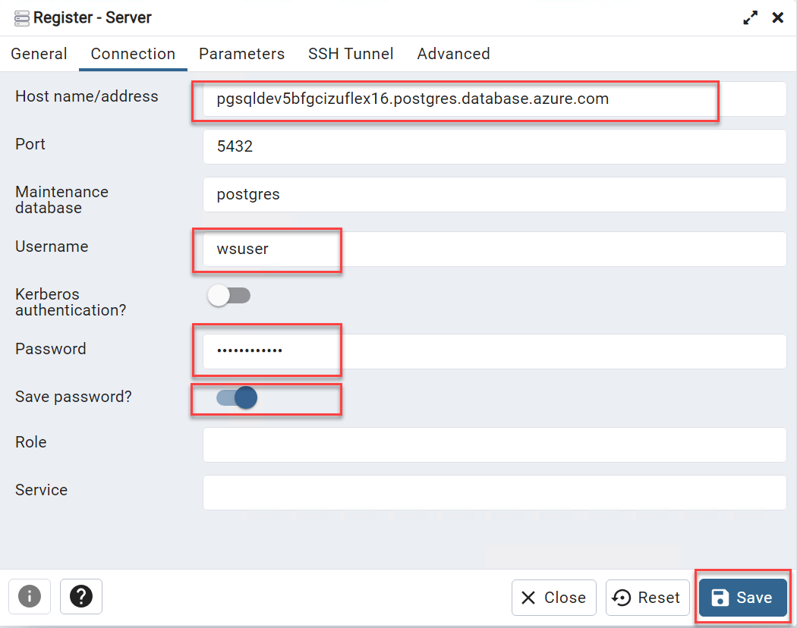
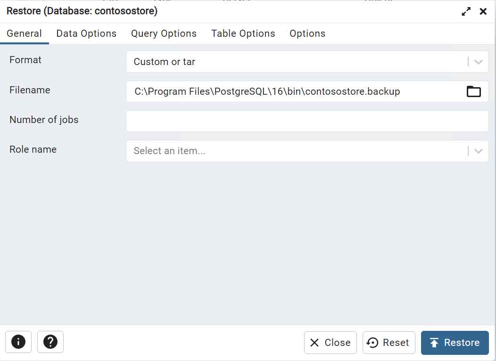

## Migrate the on-premises database

### pgAdmin

#### Export the data

1. In the **paw-1** virtual machine, open **pgAdmin**
2. Connect to the local Postgres 16 instance using `wsuser` with `Solliance123` password
3. Expand **Databases->ContosoStore**
4. Export the `contosostore` database
   1. Right-click the `contosostore` database, select **Backup...**
      >> Note: If the error that the *Utility not found* is displayed, add the Binary path for PostgreSQL 16. Find this by going to **File->Preferences->Paths->Binary paths** and adding the path to the PostgreSQL 16 binaries: `C:\Program Files\PostgreSQL\16\bin` and pressing **Save**.

      

   2. For the filename, select the folder icon
   3. Type `contosostore.backup`, select **Save**
   4. Select **Backup**

#### Import the data

1. Connect to the target PostgreSQL instance
   1. Right-click **Servers**, select **Register->Server**
   2. On the `General` tab, for the name, type **pgsqldevSUFFIXflex16**
   3. Switch to the `Connection` tab
      1. For the hostname, type the dns of the Azure Database for PostgreSQL Flexible Server (ex `pgsqldevSUFFIXflex16.postgres.database.azure.com`)
      2. For the username, type **wsuser**
      3. For the password type **Solliance123**
      4. Toggle the **Save password?** button
      5. Select **Save**

      

2. Import the backup
   1. Expand the **pgsqldevSUFFIXflex16.postgres.database.azure.com->Databases** nodes
   2. Right-click on **Databases**, select **Create->Database...**
   3. For the name, type **contosostore** and press **Save**
   4. Right-click the **contosostore** node, select **Restore...**
   5. For format, select **Custom or tar**
   6. For the filename, select the folder icon.
   7. Select the `C:\temp\contosostore\contosostore.backup` file, then select **Open**
   8. Select **Restore**, after a few momemts, the database will be imported into Azure PostgreSQL. It is possible the import will indicate failure but still succeed. Verify by selecting all items from the `items` table.

      
