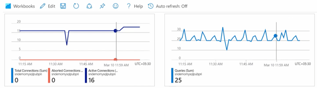
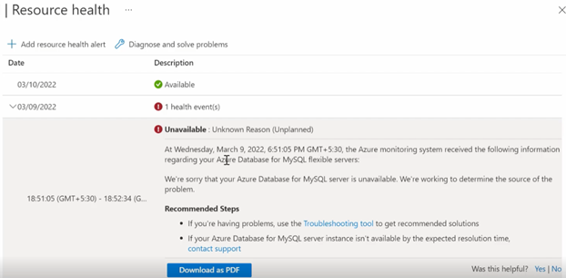
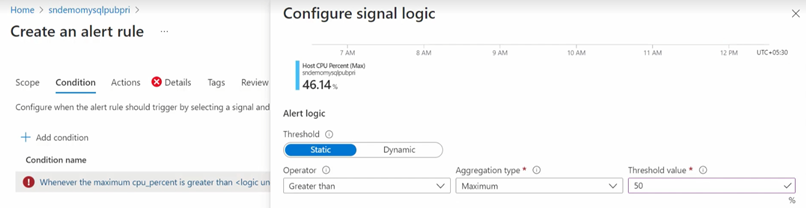

## Monitoring database operations

Azure can be configured to monitor Azure Database for PostgreSQL Flexible Server instances and databases. This includes items such as metrics and logs.

### Azure Database for PostgreSQL Flexible Server overview

The Azure Portal resource overview excellent overview of the PostgreSQL metrics. This high-level dashboard provides insight into the typical database monitoring counters, like CPU, IO, Query Count, etc.


### Metrics

For more specific metrics, navigate to the **Monitoring** section. Select **Metrics**. More custom granular metrics can be configured and displayed.


  [Monitor Azure Database for PostgreSQL Flexible Servers with built-in metrics](https://learn.microsoft.com/azure/postgresql/flexible-server/concepts-monitoring)

### Diagnostic settings

Diagnostic settings allow you to route platform logs and metrics continuously to other storage and ingestion endpoints.


  [Set up diagnostics](https://learn.microsoft.com/azure/postgresql/flexible-server/concepts-audit)

### Log Analytics

Once you configure your Diagnostic Settings, you can navigate to the Log Analytics workspace. You can perform specific filtered queries on interesting categories. Are you looking for slow queries?


Now, you can review the results from your query. There is a wealth of information about the category.


PostgreSQL audit log information is also available.


  [View query insights by using Log Analytics](https://learn.microsoft.com/azure/postgresql/flexible-server/flexible-server/tutorial-query-performance-insights#view-query-insights-by-using-log-analytics)

### Workbooks

As mentioned previously, Workbooks is a simple canvas to visualize data from different sources, like Log Analytics workspace. It is possible to view performance and storage metrics all in a single pane.



CPU, IOPS, and other common monitoring metrics are available. You can also access Query Performance Insight.


In addition to the fundamental server monitoring aspects, Azure provides tools to monitor application query performance. Correcting or improving queries can lead to significant increases in the query throughput. Use the [Query Performance Insight tool](https://learn.microsoft.com/azure/postgresql/flexible-server/concepts-query-performance-insight) to:

- Analyze the longest-running queries and determine if it is possible to cache those items.
- If they are deterministic within a set period, modify the queries to increase their performance.

In addition to the query performance insight tool, `Wait statistics` provides a view of the wait events that occur during the execution of a specific query.

> **Warning**: Wait statistics are meant for troubleshooting query performance issues. It is recommended to be turned on only for troubleshooting purposes.

Finally, the `slow_query_log` can be set to show slow queries in the PostgreSQL log files (default is OFF). The `long_query_time` server parameter can be used to log long-running queries (default long query time is 10 sec).

  [Monitor Azure Database for PostgreSQL Flexible Server by using Azure Monitor workbooks](https://learn.microsoft.com/azure/mysql/flexible-server/concepts-workbooks)

### Resource health

It is essential to know if the PostgreSQL service has experienced a downtime and the related details. Resource health can assist with this information. If you need additional assistance, a helpful contact support link available.



### Activity logs

This area captures the administrative events captured over a period of time.


The event details can be viewed as well. These details can be extremely helpful when troubleshooting.


### Creating alerts

You can create alerts in a couple of ways. Navigate to the **Alerts** menu item in the portal and create it manually.


You can also create alerts from the Metrics section.



Once the alert has been configured, you can create an action group to send a notification to the operations team.

  [Set up alerts on metrics for Azure Database for PostgreSQL Flexible Server-Flexible Server](https://learn.microsoft.com/azure/postgresql/flexible-server/howto-alert-on-metrics)

### Server Logs

By default, the server logs feature in Azure Database for PostgreSQL - Flexible Server is disabled. However, after you enable the feature, a flexible server starts capturing events of the selected log type and writes them to a file. You can then use the Azure portal or the Azure CLI to download the files to assist with your troubleshooting efforts.

For more information on how to enable and download the server logs, reference [Enable, list and download server logs for Azure Database for PostgreSQL - Flexible Server](https://learn.microsoft.com/azure/postgresql/flexible-server/how-to-server-logs-portal).

### Server Resource Logs

Server logs from Azure Database for PostgreSQL Flexible Server can also be extracted through the Azure platform *resource logs*, which track data plane events. Azure can route these logs to Log Analytics workspaces for manipulation and visualization through KQL.

In addition to Log Analytics, the data can also be routed to Event Hubs for third-party integrations and Azure storage for long-term backup.

For more information on basic PostgreSQL logs, reference [Logs in Azure Database for PostgreSQL - Flexible Server](https://learn.microsoft.com/azure/postgresql/flexible-server/concepts-logging).

### PostgreSQL audit logs (pgAudit)

In addition to metrics, it is also possible to enable PostgreSQL logs to be ingested into Azure Monitor. While metrics are better suited for real-time decision-making, logs are also useful for deriving insights. One source of logs generated by Flexible Server is PostgreSQL audit logs, which indicate connections, DDL and DML operations, and more. Many businesses utilize audit logs to meet compliance requirements, but enabling audit logs can impact performance.

PostgreSQL has a robust built-in audit log feature available through the `pgaudit` extension. This [audit log feature is disabled](https://learn.microsoft.com/azure/postgresql/flexible-server/concepts-audit) in Azure Database for PostgreSQL Flexible Server by default. Server level logging can be enabled by adding the `pgaudit` server extension and then modifiying various server parameters. For information on configuring these parameters, reference [Audit logging in Azure Database for PostgreSQL - Flexible Server](https://learn.microsoft.com/azure/postgresql/flexible-server/concepts-audit).


Once enabled, logs can be accessed through [Azure Monitor](https://learn.microsoft.com/azure/azure-monitor/overview) and [Log Analytics](https://learn.microsoft.com/azure/azure-monitor/platform/design-logs-deployment). The following KQL query can be used to access `AUDIT:` based logs:

```kql
AzureDiagnostics
| where Resource =~ "myservername"
| where Category == "PostgreSQLLogs"
| where TimeGenerated > ago(1d)
| where Message contains "AUDIT:"
```

You can also send in custom error message from your workload using the `RAISE WARNING` command.

```psql
CREATE OR REPLACE PROCEDURE my_proc(schema_name TEXT)
LANGUAGE plpgsql
AS $$
BEGIN
  RAISE WARNING 'my_proc executed for schema %', schema_name;
  -- add your procedure logic here
END;
$$;

CALL my_proc('my_schema');
```

You can then find the data by using the following KQL query:

```kql
AzureDiagnostics
| where Category == "PostgreSQLLogs"
| where Message contains "my_proc executed for schema" 
```

It is also possible to change the prefix of the log by changing the `log_line_prefix` server parameter. For example, you can get the user name in the log line prefix by adding `%u` to log_line_prefix. For example:

```text
'%m [%p] %q%u@%d (%h) '
```

> **Warning**: Excessive audit logging can degrade server performance, so be mindful of the events and users configured for logging.

### Azure Advisor

The Azure Advisor system uses telemetry to issue performance and reliability recommendations for your PostgreSQL database. Azure Database for PostgreSQL Flexible Server prioritize the following types of recommendations:

- **Performance**: To improve the speed of your PostgreSQL server. This includes CPU usage, memory pressure, connection pooling, disk utilization, and product-specific server parameters. For more information, see Advisor Performance recommendations.
- **Reliability**: To ensure and improve the continuity of your business-critical databases. This includes storage limits, and connection limits. For more information, see Advisor Reliability recommendations.
- **Cost**: To optimize and reduce your overall Azure spending. This includes server right-sizing recommendations. For more information, see Advisor Cost recommendations.

For the latest information reference [Azure Advisor for PostgreSQL - Flexible Server](https://learn.microsoft.com/azure/postgresql/flexible-server/concepts-azure-advisor-recommendations).
