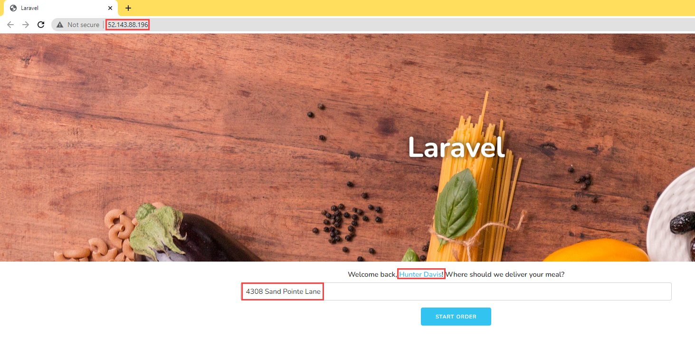

## Deploying a Laravel app backed by a Java REST API to AKS

### Evolve the sample application

In the previous stages of this developer guide, an MVC app was deployed on an Azure VM, containerized, and then hosted on various PaaS services (e.g. Azure Container Instances, App Service, AKS). The second sample app provided with this developer guide delegates database access operations (Flexible Server queries) to a Java REST API. The Laravel app calls the REST API.

One of the advantages of this microservices architecture is that the Java API and the Laravel app can be scaled independently. Both deployments have high availability. Moreover, though this exercise does not demonstrate how to configure CI/CD for this app, but can apply the same techniques learned previously.

We recommend creating a new resource group for this exercise.

```bash
az group create -n [RESOURCE GROUP NAME] -l [AZURE REGION]
```

### Download the tools

To complete this document, install the following tools on the development machine:

- Azure CLI
- [Apache Maven:](https://maven.apache.org/) This tool manages the build processes for the Java API. Add the Maven executable to the system's PATH variable for simpler usage.
- [Docker Desktop:](https://docs.docker.com/desktop/) Docker Desktop provides an intuitive management interface for the Docker service. This guide uses the Docker CLI to create Docker images.
- [kubectl:](https://kubernetes.io/docs/reference/kubectl/kubectl/) kubectl is a useful management tool for Kubernetes clusters. Install it from the Azure CLI through `az aks install-cli`.

### Provision the database

Navigate to `.\java-api\Database` from a PowerShell terminal instance. Then, execute the `create-database.ps1` script, passing the parameters in the order shown below. The command will provision a new Flexible Server instance with the app database schema.

- Provide a unique `Suffix` to ensure that the Flexible Server instance's name is unique
- Provide a strong `Password` for the database admin user (`AppAdmin`)
- Provide the name of the lab `Resource Group`
- Provide the desired `Location` for the Azure resources

```powershell
.\create-database.ps1 'Suffix' 'Password' 'Resource Group' 'Location'
```

The Flexible Server instance will have 1 vCore, 2 GiB memory, 32 GiB storage, and it will allow all clients to access it. Note that this is not recommended for production scenarios; access can be limited to target Azure resources through the Azure portal or other management tools.

> Consult the [Microsoft documentation](https://learn.microsoft.com/azure/postgresql/flexible-server/flexible-server/tutorial-deploy-springboot-on-aks-vnet) for information on how to configure private access for PostgreSQL Flexible Server from Azure Kubernetes Service. This example uses public access for simplicity.

### Create Docker images

#### API

Navigate to the `.\java-api` directory and enter the following command to create an optimized Docker image. Note that Maven does not need a Dockerfile to create this image, called `noshnowapi:0.0.1-SNAPSHOT`.

```powershell
mvn spring-boot:build-image
```

#### Laravel

Navigate to the `.\sample-php-app-rest` directory. Create a file called `.env`. Set `APP_KEY=` as the first line in the file. Then, run `php artisan key:generate` to create an application key in the `.env` file.

```txt
APP_KEY=[ARTISAN APPLICATION KEY]
```

Now, in the same directory, enter the following command to create a Docker image to serve the PHP frontend app through Apache.

```powershell
docker image build -t noshnowui:0.0.1 .
```

### Provision Azure Kubernetes Service

Navigate to `.\java-api\Kubernetes` from a PowerShell terminal instance. Then, execute the `create-azure-resources.ps1` script, using the same parameters as the prior script. The command will provision Azure Container Registry and push the two Docker images; provision a new Azure Kubernetes Service cluster and provide it access to ACR; create the `contosonoshnow` namespace within the Kubernetes cluster.

```powershell
.\create-azure-resources.ps1 'Suffix' 'Resource Group' 'Location'
```

Note that if the resources are deployed to an Azure region that supports Availability Zones, the script will co-locate the Flexible Server instance and the Kubernetes cluster.

### Deploy the API to Azure Kubernetes Service

#### Create the API Secret

Open the `api.secrets.yml` file in the `Kubernetes` directory. This file contains the base64-encoded password for the application user. Besides the administrative user, the database schema setup script created a less-privileged app user.

Run the command below from the `Kubernetes` directory to create the password secret:

```powershell
kubectl apply -f api.secrets.yml
```

#### Create the API Service

`api.service.yml` defines a Service that directs all traffic received from within the cluster on port 8080 to the pods that serve the Java API. Note that the API service is only accessible from within the cluster.

```powershell
kubectl apply -f api.service.yml
```

#### Create the API Deployment

`api.deployment.yml` defines a deployment with two pods, created from the Java API image pushed to ACR.

Open the file. Replace the two `[SUFFIX]` placeholders with the values used when provisioning the Azure resources. Then, execute the command below:

```powershell
kubectl apply -f api.deployment.yml
```

Congratulations. The API to Azure Kubernetes Service is now deployed and exposed internally through a Service.

### Deploy the Laravel app to Azure Kubernetes Service

#### Create the Laravel app Service

Navigate to `.\sample-php-app-rest\Kubernetes`. Create a service to expose the Laravel app through a public IP address (in this case, through a Load Balancer provisioned in Azure).

```powershell
kubectl apply -f web.service.yml
```

#### Create the Laravel app Deployment

The deployment specified in the `web.deployment.yml` file (in the same directory as the previous step) creates two pods from the Laravel app image pushed to ACR.

Again, replace the `[SUFFIX]` placeholder in the file. Then, create the deployment.

```powershell
kubectl apply -f web.deployment.yml
```

### Browse to the app

Run `kubectl get svc` to get the public IP address of `laravel-ui-service`. Copy the `EXTERNAL-IP` value to a browser window.


If all functions correctly, the user details for a random user will be displayed.


