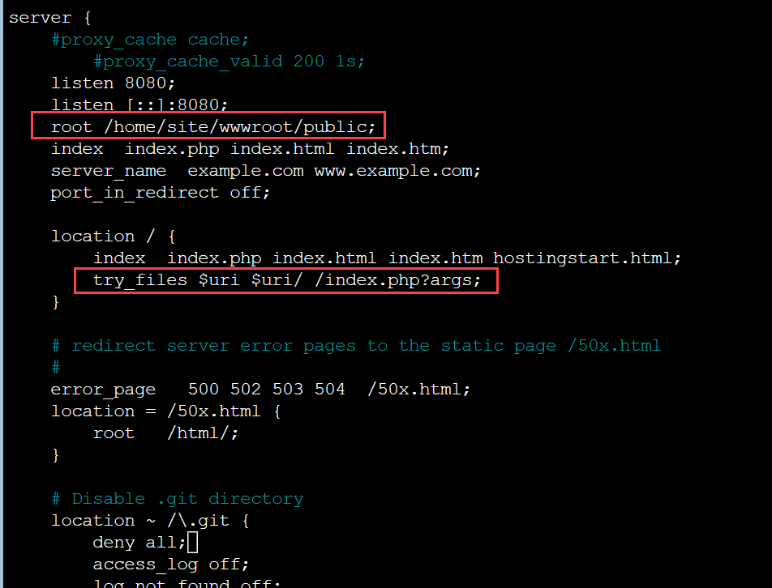

# Cloud Deployment to Azure App Service

This is a simple app that runs PHP code to connect to a PostgreSQL database.  The application and database must be migrated to Azure App Service and Azure Database for PostgreSQL Flexible Server.

## Basic Deployment

### Update env

1. Open the `C:\labfiles\microsoft-postgresql-developer-guide` folder in Visual Studio code
2. If prompted, select **Yes, I trust the authors**
3. Switch to the browser, browse to the **pgsqldevSUFFIX** app service
4. Select the **Overview** link, copy the **URL** for use later

### Deploy the Application

1. Switch to the **Paw-1** virtual machine remote desktop.
2. Open a terminal window, run the following to deploy the zip to Azure, be sure to replace the `SUFFIX`:

    > NOTE: The virtual machine is running under a Managed Identity with `owner` access to the resource group.

    ```PowerShell
    cd "C:\labfiles\microsoft-postgresql-developer-guide"

    Connect-AzAccount -identity

    $resourceGroups = Get-AzResourceGroup
    
    $resourceGroupName = $resourceGroups[0].ResourceGroupName
    $suffix = $resourceGroups[0].tags['Suffix']

    $appName = "pgsqldev$($suffix)linux";
    $app = Get-AzWebApp -ResourceGroupName $resourceGroupName -Name $appName

    #NOTE: This can't be used this for linux based deployments
    #Compress-Archive -Path .\sample-php-app\* -DestinationPath site.zip -force

    7z a -r ./site.zip ./sample-php-app/*
    
    #Publish-AzWebApp -WebApp $app -ArchivePath "C:\labfiles\microsoft-postgresql-developer-guide\site.zip" -force

    #Reference - https://learn.microsoft.com/azure/app-service/deploy-local-git?tabs=cli

    az login --scope https://management.core.windows.net//.default --identity

    #setup local git
    az webapp deployment source config-local-git --name $appName --resource-group $resourceGroupName;

    #set the username and password
    az webapp deployment user set --user-name "pgsqldev$suffix" --password "Solliance123";

    #get the github link to the azure app service
    #$url = az webapp deployment list-publishing-profiles --resource-group $resourceGroupName --name $appName

    $url = az webapp deployment list-publishing-credentials --resource-group $resourceGroupName --name $appName --query scmUri
    $url = $url.replace("`"","") + "/$appName.git"

    az webapp config appsettings set --name $appName --resource-group $resourceGroupName --settings DEPLOYMENT_BRANCH='main'

    #setup git
    git config --global user.email "you@example.com"
    git config --global user.name "Your Name"
    git config --global http.postBuffer 524288000

    #do the deployment
    cd "C:\labfiles\microsoft-postgresql-developer-guide"

    #remove current git setup
    remove-item .git -force -Recurse

    cd "C:\labfiles\microsoft-postgresql-developer-guide\sample-php-app"

    #remove current git setup
    remove-item .git -force -Recurse

    git init
    git remote rm origin
    git remote rm azure
    git add .
    git commit -m "init commit"
    git remote add azure $url
    git branch -m azure main
    git pull --allow-unrelated-histories
    git push -u azure main

    #only works with 7.4 PHP / Apache
    #az webapp deploy --resource-group $resourceGroupName --name $appName --src-path "C:\labfiles\microsoft-postgresql-developer-guide\site.zip" --type zip

    ```

### Update Application Settings

1. Switch to the Azure Portal, browse to the **pgsqldevSUFFIXlinux** app service
3. Under **Development tools**, select **SSH**, then select **Go**
4. Login using your lab credentials (ex: Azure Entra)
5. Run the following:

    ```bash
    cp /etc/nginx/sites-available/default /home/site/default
    ```

6. Edit the `default` file

    ```bash
    nano /home/site/default
    ```

7. Modify the root to be the following:

    ```bash
    root /home/site/wwwroot/public
    ```

8. Add the following to the `location` section after the `index  index.php index.html index.htm hostingstart.html;` line:

    ```bash
    try_files $uri $uri/ /index.php?$args;
    ```

    

9. Press **Ctrl-X**, then select **Y** to save the file
10. Run the following command to add a startup.sh file:

   ```bash
    nano /home/site/startup.sh
    ```

11. Copy and paste the following:

    ```bash
    #!/bin/bash

    cp /home/site/default /etc/nginx/sites-available/default
    service nginx reload
    ```

12. Press **Ctrl-X**, then select **Y** to save the file
13. Open the `.env` file in the text editor.

    ```bash
    nano /home/site/wwwroot/.env
    ```

14. Update the `APP_URL` parameter to the App Service URL (found on the **Overview** tab of the Azure portal). Then, set `ASSET_URL` to `APP_URL`.

    ```bash
    APP_URL=https://[APP SERVICE NAME].azurewebsites.net
    ASSET_URL = "${APP_URL}"
    ```

15. Press **Ctrl-X**, then select **Y** to save the file
16. Run the following commands to setup the Larvael application:

    ```powershell
    mkdir /home/site/ext 
    cd /home/site/ext 
    curl -sS https://getcomposer.org/installer | php

    cp /home/site/ext/composer.phar /usr/local/bin/composer

    cd /home/site/wwwroot

    composer.phar update

    php artisan config:clear

    php artisan key:generate
    ```

15. Switch back the Azure Portal and the app service, under **Settings**, select **Configuration**
16. Select **General settings**
17. In the startup command textbox, type `/home/site/startup.sh`
18. Select **Save**, then select **Continue**

### Test the Application

1. Browse to `https://pgsqldevSUFFIX.azurewebsites.net/` to see the app load with SSL

### Add Firewall IP Rule and Azure Access

1. Switch to the Azure Portal
2. Browse to the `pgsqldevSUFFIXflex16` Azure Database for PostgreSQL Flexible Server
3. Under **Settings**, select **Connection security**
4. Select the **Allow access to Azure services** toggle to **Yes**
5. Select **Save**

### Migrate the Database Use the steps in [Migrate your database](./Misc/02_MigrateDatabase) article.

## Update the connection string

1. Use the steps in [Migrate your database](./Misc/02_MigrateDatabase) article.

## Update the connection string

1. Switch to the Azure Portal
2. Browse to the **pgsqldevSUFFIX** web application
3. Under **Development Tools**, select **SSH**
4. Select **Go->**
6. Edit the **/home/site/wwwroot/pubic/database.php**:

    ```bash
    nano /home/site/wwwroot/public/database.php
    ```

7. Set the servername variable to `pgsqldevSUFFIXflex16.postgres.database.azure.com`
8. Set the username to `wsuser`
9. Set the password to `Solliance123`
10. Press **Ctrl-X**, then **Y** to save the file

## Test new settings #1

1. Browse to `https://pgsqldevSUFFIX.azurewebsites.net/database.php`, you should get results, but the connection is not secured over SSL.

## Enable SSL support

1. Download the `https://dl.cacerts.digicert.com/DigiCertGlobalRootCA.crt.pem` certificate by switching back to the SSH window, run the following:

    ```bash
    cd /home/site/wwwroot/public

    wget https://dl.cacerts.digicert.com/DigiCertGlobalRootCA.crt.pem
    ```

3. Edit the `database.php` file

    ```php
    nano /home/site/wwwroot/public/database.php
    ```

4. Update the database connection to use ssl by uncommenting the `sslmode=verify_full` line:

    ```php
    $conn_str .= 'sslmode=verify-full ';
    ```
5. Also uncomment the `sslrootcert` line:

    ```php
    //$conn_str .= 'sslrootcert=/home/site/wwwroot/public/DigiCertGlobalRootCA.crt.pem ';
    ```

6. Press Ctrl-X, then Y to save the file

## Test new settings #2

1. Browse to `https://pgsqldevSUFFIX.azurewebsites.net/database.php`, results should display.

## Update to use Environment Variables

Putting credential in the PHP files is not a best practice, it is better to utilize environment variables for this.

1. Switch back to the SSH window
2. Edit the **/home/site/wwwroot/pubic/database.php**:

    ```bash
    nano /home/site/wwwroot/pubic/database.php
    ```

3. Update the connection variables to the following:

    ```php
    $servername = getenv("APPSETTING_DB_HOST");
    $username = getenv("APPSETTING_DB_USERNAME");
    $password = getenv("APPSETTING_DB_PASSWORD");
    $dbname = getenv("APPSETTING_DB_DATABASE");
    ```

    > **NOTE** Azure App Service adds the `APPSETTING` prefix to all environment variables. You can see this by navigating to the `info.php` page and review the server variables.

4. Edit the **/home/site/wwwroot/config/database.php** (note that this is in the `config` directory):

    ```bash
    nano /home/site/wwwroot/config/database.php
    ```

5. Update the PostgreSQL connection to utilize the environment variables:

    ```php
    'host' => env('APPSETTING_DB_HOST', '127.0.0.1'),
    'port' => env('APPSETTING_DB_PORT', '5432'),
    'database' => env('APPSETTING_DB_DATABASE', 'postgres'),
    'username' => env('APPSETTING_DB_USERNAME', 'postgres'),
    'password' => env('APPSETTING_DB_PASSWORD', ''),
    ```

6. Add the environment variables to the App Service:
   - Browse to the Azure Portal
   - Select the **pgsqldevSUFFIXlinux** app service
   - Under **Settings**, select **Configuration**
   - Select **New application setting**
   - Add the following:
     - `DB_HOST` = `pgsqldevSUFFIXflex16.postgres.database.azure.com`
     - `DB_USERNAME` = `wsuser`
     - `DB_PASSWORD` = `Solliance123`
     - `DB_DATABASE` = `contosostore`
     - `DB_PORT` = `5432`
     - `APP_URL` = `https://pgsqldevSUFFIXlinux.azurewebsites.net`
    - Select **Save**, then select **Continue**

## Test new settings #3

1. Browse to `https://pgsqldevSUFFIXlinux.azurewebsites.net/database.php`, results should display.

## Create Azure Key Vault values

1. Switch to the Azure Portal
2. Browse to the **pgsqldevSUFFIX-kv** Key Vault
3. Under **Settings** select **Access Policies**
4. Select **Create**
5. For the secret permissions, select **Select all**, then select **Next**
6. For the principal, select the lab guide user account, select **Next**
1. On application, select **Next**
1. Select **Create**
1. Under **Settings**, select **Secrets**
1. Select **Generate/Import**
1. For the name, type **PostgreSQLPassword**
1. For the value, type **Solliance123**
1. Select **Create**

## Create Managed Service Identity

1. Switch to the Azure Portal
2. Browse to the **pgsqldevSUFFIXlinux** app service
3. Under **Settings**, select **Identity**
4. For the system assigned identity, toggle to **On**
5. Select **Save**, in the dialog, select **Yes**
6. Copy the **Object ID** for later user
7. Browse to the **pgsqldevSUFFIX-kv** Key Vault
8. Under **Settings** select **Access Policies**
9. Select **Create**
10. For the secret permission, select **Select all**, then select **Next**
11. For the principal, paste the **Object ID** you copied above, select **Next**
12. For application, select **Next**
13. Select **Create**
14. Under **Settings**, select **Secrets**
15. Select the **PostgreSQLPassword**
16. Select the current version
17. Copy the secret identifier for later use

## Configure Environment Variables

1. Browse to the Azure Portal
2. Select the **pgsqldevSUFFIXlinux** app service
3. Under **Settings**, select **Configuration**
4. Select **New application setting**
5. For the name, type **PostgreSQL_PASSWORD**
6. Update it to the following, replace the `SUFFIX` value:

      ```text
      @Microsoft.KeyVault(SecretUri=https://pgsqldevSUFFIX-kv.vault.azure.net/secrets/PostgreSQLPassword/)
      ```

7. Select **OK**
8. Select **Save**, then select **Continue**. Ensure a green check mark appears in the Source field.

## Update the files

1. Switch back to the SSH window
2. Edit the **/home/site/wwwroot/pubic/database.php**:

    ```bash
    nano /home/site/wwwroot/pubic/database.php
    ```

3. Update the connection variables to the following:

    ```php
    $password = getenv("APPSETTING_POSTGRESQL_PASSWORD");
    ```

    > **NOTE** Azure App Service adds the `APPSETTING` prefix to all environment variables

4. Edit the **/home/site/wwwroot/config/database.php**:

    ```bash
    nano /home/site/wwwroot/config/database.php
    ```

5. Update the PostgreSQL connection to utilize the environment variables:

    ```php
    'password' => getenv('APPSETTING_POSTGRESQL_PASSWORD')
    ```

## Test new settings #4

1. Browse to `https://pgsqldevSUFFIXlinux.azurewebsites.net/database.php`, results should display.

## Extra Resources

For an example of deploying a Django app that uses Azure Database for PostgreSQL on AppService, reference [Deploy a Python (Django or Flask) web app with PostgreSQL in Azure](https://learn.microsoft.com/azure/app-service/tutorial-python-postgresql-app).
