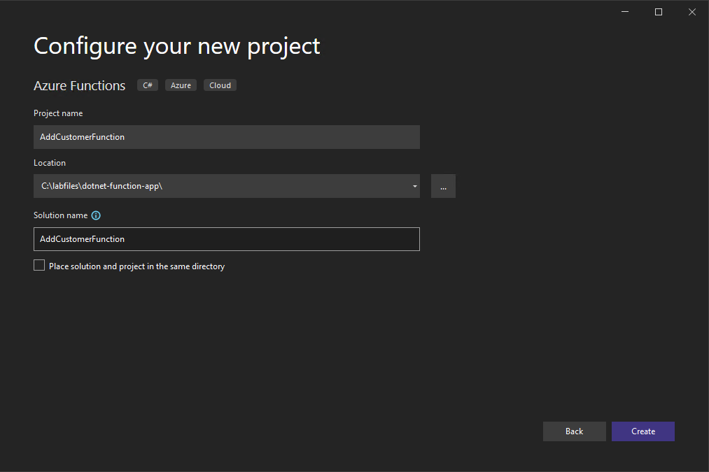
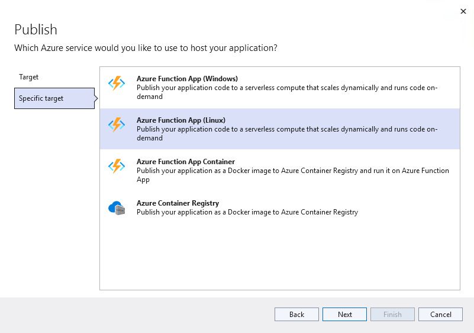

# Azure Function with PostgreSQL (.NET)

https://techcommunity.microsoft.com/t5/azure-database-for-PostgreSQL-blog/how-to-connect-to-azure-database-for-PostgreSQL-using-managed/ba-p/1518196

## Setup

It is possible to utilize Visual Studio or Visual Studio Code to create Azure Functions.  

### Install pre-requisites

Most of this is done already in the lab setup scripts, but is provided here for reference.

- Install [Visual Studio 2022 Community Edition](https://visualstudio.microsoft.com/downloads/)
  - Expand the **Download Visual Studio with .NET** dropdown for an installation package with the .NET SDK
  - Once Visual Studio loads, sign in with an Azure account
- Install the [Azure Functions core tools MSI](https://go.microsoft.com/fwlink/?linkid=2174087)

#### Install the Azure development workload for Visual Studio

- Open the Visual Studio installer from the Start menu.
- Select **Modify** next to the **Visual Studio Community 2022** installation
- Select the **Azure development** tile below the **Web & Cloud** header. Then, select **Modify** at the lower right-hand corner of the window

## Create the Function Application

The application here is based on an Http Trigger that will then make a call into the Azure Database for PostgreSQL Flexible Server instance and add some records. Create this function by performing the following steps.

- Open Visual Studio, if prompted, sign in
- Select **Create a new project**
- Search for **Azure Functions**
- Select **C#** for the language
- Select **Next**
- For the name, type **AddCustomerFunction**
- Select the project path
- Select **Next**
- Select **Create**

    

- Select the **HTTP trigger**
- For the Storage account, select **Storage Emulator**
- For the authorization level, select **Function**
- Select **Create**
- Update the function class (in `Function1.cs`) to the following. Be sure to replace the connection information. This Function completes the following tasks when its HTTP endpoint receives a request:
  - Connecting to the Azure Database for PostgreSQL Flexible Server instance provisioned in the ARM template
  - Generating a list of databases on the PostgreSQL instance
  - Building a formatted response
  - Returning the formatted response to the caller

```csharp
    public static class AddCustomerFunction
    {
        [FunctionName("AddCustomerFunction")]
        public static async Task<IActionResult> Run(
            [HttpTrigger(AuthorizationLevel.Function, "get", "post", Route = null)] HttpRequest req,
            ILogger log)
        {
            NpgsqlConnectionStringBuilder builder = new NpgsqlConnectionStringBuilder
            {
                Host = "pgsqldevSUFFIXflex16.postgres.database.azure.com",
                Username = "wsuser",
                Password = "Solliance123",
                Database = "postgres",
                SslMode = SslMode.Require
            };

            string responseMessage = "";

            using (var conn = new NpgsqlConnection(builder.ConnectionString))
            {
                conn.Open();

                using (var command = conn.CreateCommand())
                {
                    command.CommandText = "SELECT datname FROM pg_catalog.pg_database;";
                    NpgsqlDataReader r = command.ExecuteReader();

                    while (r.Read())
                    {
                        responseMessage += r["datname"] + "\r\n";
                    }
                }
            }

            return new OkObjectResult(responseMessage);
        }
    }
```

- Right-click the project, select **Manage Nuget Packages**, and select **Browse**
- Search for **Npgsql**, select **Install**
- Select **Apply**
- Select **Ok** if prompted
- Search for **Microsoft.Extensions.Logging.Abstractions**, select **Install**
- Select **Apply**
- At the top of `Function1.cs` file, add a using reference to `Npgsql` by adding the following statement.

    ```csharp
    using Npgsql;
    ```

- Press **F5** to start the function
- Open a browser window to the following. A list of databases should be displayed:

```text
http://localhost:7071/api/AddCustomerFunction
```

## Deploy the Function Application

Now that the function app is created and working locally, the next step is to publish the function app to Azure.

- Right click the project, select **Publish**
- Select **Azure**, then select **Next**
- For the target, select **Azure Function App (Linux)**

    

- Select **Next**
- Select the account, subscription and resource group
- Select the **pgsqldevSUFFIX-AddCustomerFunction** function app
- Select **Finish**
- Select **Publish**, and if prompted, select **Yes** to update the runtime version.
- Switch to the Azure portal, browse to your lab resource group
- Select the **pgsqldevSUFFIX-addcustomerfunction** Function App instance
- Under **Functions**, select **App keys**
- Copy the function app code

It should now be possible to browse to the function endpoint and see data:

```text
https://pgsqldevSUFFIX-addcustomerfunction.azurewebsites.net/api/addcustomerfunction?code=SOMECODE
```

## Test the Function App in the Azure portal

- Switch to the Azure portal, browse to your lab resource group
- Select the **pgsqldevSUFFIX-addcustomerfunction** Function App instance
- On the **Overview** page, select the **AddCustomerFunction** link
- On the **AddCustomerFunction** page, select **Code + Test**. Then, select **Test/Run** to access the built-in testing interface
- On the testing dialog, select the warning to enable CORS
- Issue a simple GET request to the Function App endpoint.

    > **NOTE** It is possible to use a *function key*, which is scoped to an individual Function App, or a *host key*, which is scoped to an Azure Functions instance.

    

- The Function App should execute successfully

## Troubleshooting

- If the application builds successfully, but deployment fails, try restarting Visual Studio and publishing the Function App again to avoid transient errors
- Enabling Application Insight logs is a useful way to debug Function Apps deployed to Azure. As Application Insights cannot be configured from the Visual Studio publish profile, consult the [Microsoft documentation](https://docs.microsoft.com/azure/azure-functions/configure-monitoring?tabs=v2#enable-application-insights-integration) for the manual setup steps
