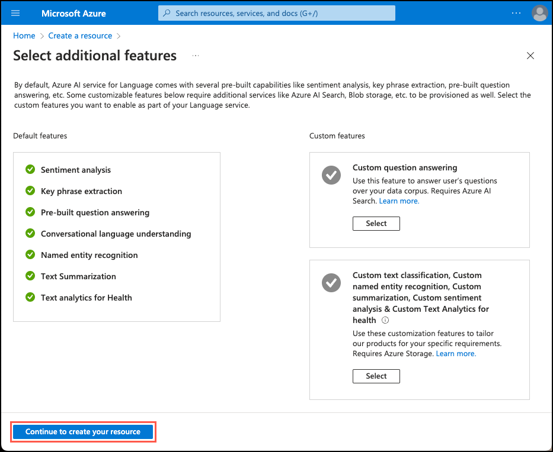

# Hands on Lab: Building AI Apps with Azure OpenAI (TODO: Change title to: Generative AI with Azure Database for PostgreSQL Flexible Server?)
[Generative AI](https://learn.microsoft.com/training/paths/introduction-generative-ai/) is a form of artificial intelligence in which [large language models](https://learn.microsoft.com/azure/postgresql/flexible-server/generative-ai-overview#large-language-model-llm) (LLMs) are trained to generate original content based on natural language input. LLMs are designed to understand and generate human-like language output, and are known for their ability to perform a wide range of natural language understanding and generation tasks. Generative AI has a wide range of applications for data-driven applications, including semantic search, recommendations systems, content generation, such as summarization, and many others.

In this lab, you take advantage of [Azure OpenAI](https://learn.microsoft.com/azure/ai-services/openai/overview) and the [Azure AI Language service](https://learn.microsoft.com/azure/ai-services/language-service/) to integrate rich generative AI capabilities directly into your Azure Database for PostgreSQL Flexible Server using the the [Azure AI Extension](https://learn.microsoft.com/azure/postgresql/flexible-server/generative-ai-azure-overview). The `azure_ai` extension adds the ability to leverage LLMs directly from your database.

> Important:
>
> This lab builds upon the work you did with extensions in Lab 3 and relies on data loaded into the Azure Database for PostgreSQL Flexible Server in that lab.

## Exercise 1: Add Azure AI and Vector extensions to allowlist

Throughout this lab, you use the [azure_ai](https://learn.microsoft.com/azure/postgresql/flexible-server/generative-ai-azure-overview) and [pgvector](https://learn.microsoft.com/azure/postgresql/flexible-server/how-to-use-pgvector) extensions to add generative AI capabilities to your PostgreSQL database. In this exercise, you add these extensions to your server's _allowlist_, as described in [how to use PostgreSQL extensions](https://learn.microsoft.com/azure/postgresql/flexible-server/concepts-extensions#how-to-use-postgresql-extensions).

1. In a web browser, navigate to your Azure Database for PostgreSQL Flexible Server resource in the [Azure portal](https://portal.azure.com/).

2. From the database's left-hand navigation menu, select **Server parameters** under **Settings**, then enter `azure.extensions` into the search box. Expand the **VALUE** dropdown list, then locate and check the box next to each of the following extensions:

    - AZURE_AI
    - VECTOR

    

3. Select **Save** on the toolbar, which will trigger a deployment on the database.

## Exercise 2: Create an Azure OpenAI resource

The `azure_ai` extension requires an underlying Azure OpenAI service to create [vector embeddings](https://learn.microsoft.com/azure/postgresql/flexible-server/generative-ai-overview#embeddings). In this exercise, you will provision an Azure OpenAI resource in the Azure portal and deploy an embedding model into that service.

### Task 1: Provision an Azure OpenAI service

In this task, you create a new Azure OpenAI service.

1. In a web browser, navigate to the [Azure portal](https://portal.azure.com/).

2. On the portal home page, select **Create a resource** under Azure services.

    

3. On the **Create a resource** page, enter `azure openai` into the search the marketplace box, then select the **Azure OpenAI** tile and select **Create** on the Azure OpenAI page.

    

4. On the Create Azure OpenAI **Basics** tab, enter the following information:

    | Parameter            | Value |
    | -------------------- | ----- |
    | **Project details**  |       |
    | Subscription         | Select the subscription you are using for resources in this lab. |
    | Resource group       | Select the resource group you created in Lab 1. |
    | **Instance details** |       |
    | Region               | For this lab, you will use a `text-embedding-ada-002` (version 2) embedding model. This model is currently only available in [certain regions](https://learn.microsoft.com/azure/ai-services/openai/concepts/models#embeddings-models). Please select a region from this list, such as `East US`, to use for this resource. |
    | Name                 | _Enter a globally unique name_, such as `aoai-postgres-labs-SUFFIX`, where `SUFFIX` is a unique string, such as your initials. |
    | Pricing tier         | Select **Standard S0**. |

    

    > Note: If you see a message that the Azure OpenAI Service is currently available to customer via an application form. The selected subscription has not been enabled for use of the service and does not have quota for any pricing tiers, you will need to click the link to request access to the Azure OpenAI service and fill out the request form.

5. Select **Next** to move to the **Networking** tab.

6. On the **Networking** tab, select **All networks, including the internet, can access this resource**.

    

7. The default settings will be used for the remaining tabs of the storage account configuration, so select **Next** until you get to the **Review** screen, then select the **Create** button on the **Review** tab to provision the Azure OpenAI service.

### Task 2: Deploy an embedding model

The `azure_ai` extension provides the ability to create vector embeddings from text. To create these embeddings requires a deployed `text-embedding-ada-002` (version 2) model within your Azure OpenAI service. In this task, you will use [Azure OpenAI Studio](https://oai.azure.com/) to create a model deployment that use can use.

1. Navigate to your newly provisioned Azure OpenAI resource in the [Azure portal](https://portal.azure.com/).

2. On the resource's **Overview** page, select the **Go to Azure OpenAI Studio** button.

    

3. In Azure OpenAI Studio, select the **Deployments** tab under **Management** in the left-hand menu, then select **+ Create new deployment** from the toolbar.

    

4. In the **Deploy model** dialog, set the following:

    - **Select a model**: Choose `text-embedding-ada-002` from the list.
    - **Model version**: Ensure **2 (Default)** is selected.
    - **Deployment name**: Enter `embeddings`.

    

5. Select **Create** to deploy the model. After a few moments, the deployment will appear in the list of deployments.

## Exercise 3: Install and configure the `azure_ai` extension

In this exercise, you install the `azure_ai` extention into your database and configure it to connect to your Azure OpenAI service.

### Task 1: Connect to the database using psql in the Azure Cloud Shell

In this task, you use the `psql` command line utility from the Azure Cloud Shell to connect to your database.

1. You need the connection details for your database to connect to it using `psql` in the Cloud Shell. Navigate to your Azure Database for PostgreSQL Flexible Server resource in the [Azure portal](https://portal.azure.com/) and in the left-hand navigation menu, select **Connect** under **Settings**.

    

2. With the **Connect** page open, select the **Cloud Shell** icon in the Azure portal toolbar to open a new [Cloud Shell](https://learn.microsoft.com/azure/cloud-shell/overview) pane at the bottom of your browser window.

    

3. From the database's **Connect** page, select **airbnb** for the **Database name** and copy the **Connection details** block.

    

4. Paste the connection details into the Cloud Shell, and replace the `{your_password}` token with the password you assigned to the `s2admin` user when creating your database. If the followed the instructions in Lab 1, the password should be `Seattle123Seattle123`.

5. Connect to your database using the [psql command-line utility](https://www.postgresql.org/docs/current/app-psql.html) by entering the following at the prompt.

    ```bash
    psql
    ```

    Connecting to the database from the Cloud Shell requires that the `Allow public access from any Azure service within Azure to the server` box is checked on the **Networking** page of the database. If you receive a message that you are unable to connect, please verify this is checked and try again.

### Task 2: Install the `azure_ai` extension

The `azure_ai` extension allows you to integrate Azure OpenAI and Azure Cognitive Services into your database. To enable the extension in your database, follow the steps below:

1. Verify that the extension was successfully added to the allowlist by running the following from the `psql` command prompt:

    ```sql
    SHOW azure.extensions;
    ```

2. Install the `azure_ai` extension using the [CREATE EXTENSION](https://www.postgresql.org/docs/current/sql-createextension.html) command.

    ```sql
    CREATE EXTENSION IF NOT EXISTS azure_ai;
    ```

### Task 3: Review the objects contained within the `azure_ai` extension

Reviewing the objects contained within the `azure_ai` extension can provide a better understanding of the capabilities it offers. In this task, you inspect the various schemas, user-defined functions (UDFs), and composite types added to the database by the extension.

1. You can use the [`\dx` meta-command](https://www.postgresql.org/docs/current/app-psql.html#APP-PSQL-META-COMMAND-DX-LC) from the `psql` command prompt to list the objects contained within the extension.

    ```psql
    \dx+ azure_ai
    ```

    The meta-command output shows the `azure_ai` extension creates three schemas, multiple user-defined functions (UDFs), and several composite types in the database. The table below lists the schemas added by the extension and describes each.

    | Schema | Description |
    | ------ | ----------- |
    | `azure_ai` | The principal schema where the configuration table and UDFs for interacting with it reside. |
    | `azure_openai` | Contains the UDFs that enable calling an Azure OpenAI endpoint. |
    | `azure_cognitive` | Provides UDFs and composite types related to integrating the database with Azure Cognitive Services. |

2. The functions and types are all associated with one of the schemas. To review the functions defined in the `azure_ai` schema, use the `\df` meta-command, specifying the schema whose functions should be displayed. The `\x auto` command preceding `\df` allows the expanded display to be automatically applied when necessary to make the output from the command easier to view in the Azure Cloud Shell.

    ```sql
    \x auto
    \df+ azure_ai.*
    ```

    The `azure_ai.set_setting()` function lets you set the endpoint and key values for Azure AI services. It accepts a **key** and the **value** to assign it. The `azure_ai.get_setting()` function provides a way to retrieve the values you set with the `set_setting()` function. It accepts the **key** of the setting you want to view. For both methods, the key must be one of the following:

    | Key | Description |
    | --- | ----------- |
    | `azure_openai.endpoint` | A supported OpenAI endpoint (e.g., <https://example.openai.azure.com>). |
    | `azure_openai.subscription_key` | A subscription key for an OpenAI resource. |
    | `azure_cognitive.endpoint` | A supported Cognitive Services endpoint (e.g., <https://example.cognitiveservices.azure.com>). |
    | `azure_cognitive.subscription_key` | A subscription key for a Cognitive Services resource. |

    > Important
    >
    > Because the connection information for Azure AI services, including API keys, is stored in a configuration table in the database, the `azure_ai` extension defines a role called `azure_ai_settings_manager` to ensure this information is protected and accessible only to users assigned that role. This role enables reading and writing of settings related to the extension. Only superusers and members of the `azure_ai_settings_manager` role can invoke the `azure_ai.get_setting()` and `azure_ai.set_setting()` functions. In Azure Database for PostgreSQL Flexible Server, all admin users are assigned the `azure_ai_settings_manager` role.

### Task 4: Set the Azure OpenAI endpoint and key

Before using the `azure_openai` functions, you must configure the extension to your Azure OpenAI service endpoint and key.

1. Using the same browser tab where the Cloud Shell is open, navigate to your Azure OpenAI resource in the [Azure portal](https://portal.azure.com/) and select the **Keys and Endpoint** item under **Resource Management** from the left-hand menu, then copy your endpoint and access key.

    

    You can use either `KEY1` or `KEY2`. Always having two keys allows you to securely rotate and regenerate keys without causing service disruption.

2. In the command below, replace the `{endpoint}` and `{api-key}` tokens with values you retrieved from the Azure portal, then run the commands from the `psql` command prompt in the Cloud Shell pane to add your values to the configuration table.

    ```sql
    SELECT azure_ai.set_setting('azure_openai.endpoint','{endpoint}');
    SELECT azure_ai.set_setting('azure_openai.subscription_key', '{api-key}');
    ```

3. Verify the settings written in the configuration table using the following queries:

    ```sql
    SELECT azure_ai.get_setting('azure_openai.endpoint');
    SELECT azure_ai.get_setting('azure_openai.subscription_key');
    ```

    The `azure_ai` extension is now connected to your Azure OpenAI account and ready to generate vector embeddings.

## Exercise 4: Generate vector embeddings with Azure OpenAI

The `azure_ai` extension's `azure_openai` schema enables the use of Azure OpenAI for creating vector embeddings for text values. Using this schema, you can [generate embeddings with Azure OpenAI](https://learn.microsoft.com/azure/ai-services/openai/how-to/embeddings) directly from the database to create vector representations of input text, which can then be used in vector similarity searches, as well as consumed by machine learning models.

[Embeddings](https://learn.microsoft.com/azure/postgresql/flexible-server/generative-ai-overview#embeddings) are a concept in machine learning and natural language processing (NLP) that involves representing objects, such as words, documents, or entities, as [vectors](https://learn.microsoft.com/azure/postgresql/flexible-server/generative-ai-overview#vectors) in a multi-dimensional space. Embeddings allow machine learning models to evaluate how closely related information is. This technique allows for efficient identification of relationships and similarities between data, allowing algorithms to identify patterns and make accurate predictions.

### Task 1: Enable vector support with the pgvector extension

The `azure_ai` extension allows you to generate embeddings for input text. To enable the generated vectors to be stored alongside the rest of your data in the database, you must install the `pgvector` extension by following the guidance in the [enable vector support in your database](https://learn.microsoft.com/azure/postgresql/flexible-server/how-to-use-pgvector#enable-extension) documentation.

1. Install the `pgvector` extension using the [CREATE EXTENSION](https://www.postgresql.org/docs/current/sql-createextension.html) command.

    ```sql
    CREATE EXTENSION IF NOT EXISTS vector;
    ```

2. With vector supported added to your database, add a new column to the `listings` table using the `vector` data type to store embeddings within the table. The `text-embedding-ada-002` model produces vectors with 1536 dimensions, so you must specify `1536` as the vector size.

    ```sql
    ALTER TABLE abb.listings
    ADD COLUMN description_vector vector(1536);
    ```

### Task 2: Generate and store vector embeddings

The `listings` table is now ready to store embeddings. Using the `azure_openai.create_embeddings()` function, you create vectors for the `description` field and insert them into the newly created `description_vector` column in the `listings` table.

1. Before using the `create_embeddings()` function, run the following command to inspect it and review the required arguments:

    ```sql
    \df+ azure_openai.*
    ```

    The `Argument data types` property in the output of the `\df+ azure_openai.*` command reveals the list of arguments the function expects.

    | Argument | Type | Default | Description |
    | -------- | ---- | ------- | ----------- |
    | deployment_name | `text` || Name of the deployment in Azure OpenAI studio that contains the `text-embeddings-ada-002` model. |
    | input | `text` || Input text used to create embeddings. |
    | timeout_ms | `integer` | 3600000 | Timeout in milliseconds after which the operation is stopped. |
    | throw_on_error | `boolean` | true | Flag indicating whether the function should, on error, throw an exception resulting in a rollback of the wrapping transactions. |

2. The first argument required by the `azure_openai.create_embeddings()` function is the `deployment_name`. This name was assigned when you deployed the embeddings model in your Azure OpenAI account. To retrieve this value, return to [Azure OpenAI Studio](https://oai.azure.com/), select **Deployments** under **Management** in the left-hand navigation menu. On the **Deployments** page, copy the **Deployment name** value associated with the `text-embedding-ada-002` model deployment.

    

3. Using the deployment name, run the following query to update each record in the `listings` table, inserting the generated vector embeddings for the `description` field into the `description_vector` column using the `azure_openai.create_embeddings()` function. Replace `{your-deployment-name}` with the **Deployment name** value you copied from the Azure OpenAI Studio **Deployments** page:

    ```sql
    WITH empty_vectors AS (
        SELECT id FROM abb.listings
        WHERE description_vector IS NULL
        LIMIT 100
    )
    UPDATE abb.listings l
    SET description_vector = azure_openai.create_embeddings('{your-deployment-name}', l.description, throw_on_error => false)
    WHERE id IN (SELECT id FROM empty_vectors);
    ```

    Rerun the above query until all of the records have been updated. This will be indicated by an output that reads `UPDATE ##`, where `##` is a number less than 100. TODO: Mention the requests per minute rate limit.

    **TODO: Determine if it makes sense to just do a couple hundred records and base the following queries off of those, or if we want to show how to handle cases, like above, where there are many records, and you have to account for rate limiting and token throttling.**

4. Execute the following query to view the embeddings generated for the first record in the table.

    ```sql
    SELECT description_vector FROM abb.listings LIMIT 1;
    ```

    Each embedding is a vector of floating point numbers, such that the distance between two embeddings in the vector space is correlated with semantic similarity between two inputs in the original format.

### Task 3: Perform a vector similarity search

Vector similarity is a method used to measure how similar two items are by representing them as vectors, which are series of numbers. Vectors are often used to perform searches using LLMs. Vector similarity is commonly calculated using distance metrics, such as Euclidean distance or cosine similarity. Euclidean distance measures the straight-line distance between two vectors in the n-dimensional space, while cosine similarity measures the cosine of the angle between two vectors.

1. To enable more efficient searching over the `vector` field by creating an index on `listings` using cosine distance and [HNSW](https://github.com/pgvector/pgvector#hnsw), which is short for Hierarchical Navigable Small World. HNSW allows `pgvector` to use the latest graph-based algorithms to approximate nearest-neighbor queries.

    ```sql
    CREATE INDEX ON abb.listings USING hnsw (description_vector vector_cosine_ops);
    ```

2. With everything now in place, you are now ready to execute a [cosine similarity](https://learn.microsoft.com/azure/ai-services/openai/concepts/understand-embeddings#cosine-similarity) search query against the database. Run the query below to do a vector similarity search against listing descriptions. The embeddings are generated for an input question and then cast to a vector array (`::vector`), which allows it to be compared against the vectors stored in the `listings` table.

    ```sql
    SELECT id, name, description FROM abb.listings
    ORDER BY description_vector <=> azure_openai.create_embeddings('embeddings', 'Properties with a private room near Discovery Park')::vector
    LIMIT 3;
    ```

    The query uses the `<=>` [vector operator](https://github.com/pgvector/pgvector#vector-operators), which represents the "cosine distance" operator used to calculate the distance between two vectors in a multi-dimensional space.

## Exercise 5: Integrate Azure AI Services

The Azure AI services integrations included in the `azure_cognitive` schema of the `azure_ai` extension provide a rich set of AI Language features accessible directly from the database. The functionalities include sentiment analysis, language detection, key phrase extraction, entity recognition, and text summarization. Access to these capabilities is enabled through the [Azure AI Language service](https://learn.microsoft.com/azure/ai-services/language-service/overview).

To review the complete list of Azure AI capabilities accessible through the extension, view the [Integrate Azure Database for PostgreSQL Flexible Server with Azure Cognitive Services documentation](https://learn.microsoft.com/azure/postgresql/flexible-server/generative-ai-azure-cognitive).

### Task 1: Provision an Azure AI Language service

An [Azure AI Language](https://learn.microsoft.com/azure/ai-services/language-service/overview) service is required to take advantage of the `azure_ai` extensions cognitive functions. In this exercise, you will create an Azure AI Language service to use for the exercises in this lab.

1. In a web browser, navigate to the [Azure portal](https://portal.azure.com/).

2. On the portal home page, select **Create a resource** under Azure services.

    

3. On the **Create a resource** page, select `AI + Machine Learning` from the left-hand menu, then select **Language service**.

    

4. On the **Select additional features** dialog, select **Continue to create your resource**.

    

5. On the Create Language **Basics** tab, enter the following:

    | Parameter            | Value |
    | -------------------- | ----- |
    | **Project details**  |       |
    | Subscription         | Select the subscription you are using for resources in this lab. |
    | Resource group       | Select the resource group you created in Lab 1. |
    | **Instance details** |       |
    | Region               | Select the region you used for your Azure Database for PostgreSQL Flexible Server resource. |
    | Name                 | _Enter a globally unique name_, such as `lang-postgres-labs-SUFFIX`, where `SUFFIX` is a unique string, such as your initials. |
    | Pricing tier         | Select the free pricing tier, **Free F0**. |
    | Responsible AI Notice | Check the box to certify you have reviewed and acknowledged the Responsible AI Notice. |

    

6. The default settings will be used for the remaining tabs of the Language service configuration, so select the **Review + create** button.

7. Select the **Create** button on the **Review + create** tab to provision the Language service.

8. When the Language service deployment completes, select **Go to resource group** on the deployment page.

    

### Task 2: Set the Azure AI Language service endpoint and key

As with the `azure_openai` functions, to successfully make calls against Azure AI services using the `azure_ai` extension, you must provide the endpoint and a key for your Azure AI Language service.

1. Using the same browser tab where the Cloud Shell is open, navigate to your Language service resource in the [Azure portal](https://portal.azure.com/) and select the **Keys and Endpoint** item under **Resource Management** from the left-hand navigation menu.

    

2. Copy your endpoint and access key values, then in the command below, replace the `{endpoint}` and `{api-key}` tokens with values you retrieved from the Azure portal. Run the commands from the `psql` command prompt in the Cloud Shell to add your values to the configuration table.

    ```sql
    SELECT azure_ai.set_setting('azure_cognitive.endpoint','{endpoint}');
    SELECT azure_ai.set_setting('azure_cognitive.subscription_key', '{api-key}');
    ```

### Task 3: Analyze sentiment of reviews

In this task, you will use the `azure_cognitive.XXX` function to analyze the sentiment of reviews for properties and assign the sentiment score to a new column in the reviews table.

TODO...

1. To perform sentiment analysis using the `azure_cognitive` schema in the `azure_ai` extension, you use the `analyze_sentiment` function. Run the command below to quickly review that function:

    ```sql
    \df azure_cognitive.analyze_sentiment
    ```

2. It is also important to understand the output of that function, so you can properly handle the value it returns. Run the following command to inspect the `sentiment_analysis_result` type:

    ```sql
    \dT+ azure_cognitive.sentiment_analysis_result
    ```

    This `azure_cognitive.sentiment_analysis_result` is a result record containing the sentiment predictions of the input text. It contains the sentiment, which can be positive, negative, neutral and mixed; and the score for positive, neutral and negative found in the text represented as a real number between 0 and 1. For example in (neutral,0.26,0.64,0.09), the sentiment is neutral with positive score at 0.26, neutral at 0.64 and negative at 0.09.

3. Now that you have an understanding of how to analyze sentiment using the extension and what the expected return type is, execute the following query to see how it works:

    ```sql
    ```
